# MAESTRO - Référentiel des Contenus & Cadrage Métier MRO

Ce document constitue le référentiel textuel, méthodologique et technique synchronisé avec l'application SPA `index.html`. Il rassemble le contexte opérationnel, les enjeux de gouvernance des données, les descriptions fonctionnelles, les représentations graphiques Mermaid ainsi que les extraits des tables dynamiques et formules DAX.

---

## Sommaire
- [Étape 0 : Contexte & Documentation](#étape-0--contexte--documentation)
- [Étape 1 : Question (Cadrage métier prioritaire)](#étape-1--question)
- [Étape 2 : Modèle (Granularité & Tables de calcul)](#étape-2--modèle)
- [Étape 3 : TAT (Méthode de calcul du Turn Around Time)](#étape-3--tat)
- [Étape 4 : Délai (Visualisations & Alertes TAT)](#étape-4--délai)
- [Étape 5 : Capacité (Méthode d'évaluation de la Capacité Atelier)](#étape-5--capacité)
- [Étape 6 : Saturation (Visualisations de la Charge Atelier)](#étape-6--saturation)
- [Étape 7 : Synthèse, Profils & Dashboard Dérivé](#étape-7--synthèse-profils--dashboard-dérivé)
- [Stratégie de Génération de Données & Moteur Pseudo-Aléatoire Seedé](#stratégie-de-génération-de-données--moteur-pseudo-aléatoire-seedé)

---

## Étape 0 : Contexte & Documentation

> **En-tête de l'interface :** Étape 0 : Contexte & Documentation  
> **Comportement :** La page Étape 0 charge et affiche le contenu des fichiers Markdown du dossier racine via un sélecteur en haut (`readme.md` par défaut, puis `content.md`, `AGENTS.md`, `svg_illustrations.md`, `data.json`). Les fichiers `.json` (`data.json`) sont affichés en JSON formaté (pretty-print) dans un bloc mono-police.

### 0.1 Contenu par défaut (readme.md)
Le fichier `readme.md`, affiché par défaut, porte le **contexte opérationnel** et le **rôle du consultant / data lead supervisor** :
- **Contexte Opérationnel & Déploiement BI :** Déploiement d'un outil décisionnel Power BI de cadrage de charge et de pilotage du TAT sur les flottes CFM56-7B, CFM56-5B, LEAP-1A, LEAP-1B, GE90-115B, M88-2, sur 10 centres Safran (FR-Villaroche, FR-Montereau, FR-Châtellerault, BE-Bruxelles, FR-Saint-Quentin, FR-Gennevilliers, FR-Bordeaux, FR-Toulouse, BE-Liège, FR-Le Creusot).
- **Rôle & Enjeux du Consultant / Data Lead Supervisor :** Arbitrage de la source de vérité (Golden Source), supervision de la qualité et du cycle de vie des données, normalisation des règles de calcul (Data Dictionary) et éthique de restitution (RLS/RBAC).

> *(La **Méthodologie Data & Gouvernance** est consultable à tout moment via le bouton d'information `i` (icône Lucide) présent à côté du titre de chaque étape, ouvrant une modale globale avec ancres de navigation directe.)*

---

## Étape 1 : Question

> **Question de cadrage :** Quel est le premier problème que le tableau de bord doit résoudre ?  
> **En-tête de l'interface :** Étape 1 : Cadrer la question métier prioritaire (`🎯 Cadrage du Persona Métier`)

### Options Décisionnelles Disponibles :
1. **Option 1.A : Urgence opérationnelle (AOG)**
   - *Sous-titre :* Alerte temps réel AOG & escalade immédiate
   - *Description :* Alerter en direct sur les moteurs à risque d'immobilisation avion (**AOG**). Escalade immédiate vers les chefs d'atelier dès dérive critique.
   - *Orientation de restitution :* Badges d'alerte rouge clignotant, identification des ESN en souffrance.
   - *Exemples de questions métiers cibles :*
     - Quels réacteurs en atelier risquent de clouer un appareil au sol sous 48h ?
     - Quel chef d'atelier doit être alerté en priorité sur une dérive critique ?
     - Quels dossiers urgents doivent préempter les créneaux d'usinage et de banc ?
2. **Option 1.B : Engagements contractuels (SLA)**
   - *Sous-titre :* Respect des SLA & vision globale par compagnie
   - *Description :* Garantir le respect des **SLA** et du TAT moyen par compagnie aérienne et typologie de contrat.
   - *Orientation de restitution :* Jauges de conformité contractuelle, décompte des dossiers livrés dans les temps.
   - *Exemples de questions métiers cibles :*
     - Quel est le taux de respect des SLA engagés auprès d'Air France ou Delta ?
     - Quel contrat MRO génère les dépassements de TAT moyen les plus récurrents ?
     - Comment benchmarke-t-on le TAT effectif vs contractuel par type de flotte ?
3. **Option 1.C : Optimisation des capacités**
   - *Sous-titre :* Lissage de charge & élimination des goulets ateliers
   - *Description :* Équilibrer les charges multi-sites (Montereau, Villaroche, Bruxelles), lisser les goulets et l'usinage.
   - *Orientation de restitution :* Comparatif capacitaire inter-sites et détection des îlots saturés.
   - *Exemples de questions métiers cibles :*
     - Quel site Safran approche du seuil critique de 85% de saturation ?
     - Peut-on réorienter des modules CFM56 de Montereau vers Bruxelles ?
     - Où se situent les goulets d'usinage retardant le passage sur banc ?
4. **Option 1.D : Suivi Retard & Pénalités**
   - *Sous-titre :* Dérapage en jours ouvrés & exposition financière (€)
   - *Description :* Mesurer le dérapage en **jours ouvrés** au-delà du SLA et chiffrer l'exposition financière (€).
   - *Orientation de restitution :* Exposition financière cumulée, compteurs d'ESN sous pénalités journalières.
   - *Exemples de questions métiers cibles :*
     - Quel montant de pénalités contractuelles court aujourd'hui sur les visites en retard ?
     - Quels moteurs accumulent plus de 5 jours de dérive financièrement pénalisante ?
     - Quel barème financier s'applique par jour ouvré supplémentaire sur chaque client ?
5. **Option 1.E : Logistique et Approvisionnement**
   - *Sous-titre :* Disponibilité stock, délais fournisseurs et kits complets
   - *Description :* Suivre les pièces en stock, les délais fournisseurs et éliminer les ruptures bloquant la réparation.
   - *Orientation de restitution :* Taux de service OTIF, détection des kits incomplets (aubes HP, LLP).
   - *Exemples de questions métiers cibles :*
     - Quelles pièces critiques (aubes monocristal, LLP) manquent à l'appel pour fermer un kit ?
     - Quel est le taux de service OTIF de nos sous-traitants et équipementiers ?
     - Combien d'heures d'attente atelier sont directement causées par une rupture magasin ?
6. **Option 1.F : Data Gouvernance**
   - *Sous-titre :* Suivi des usages métiers, fiabilisation & pertinence des modèles
   - *Description :* Suivre les usages métiers, fiabiliser la donnée et s'assurer de la pertinence des modèles en mesurant l'écart prévisionnel vs effectif.
   - *Orientation de restitution :* Dérive des algorithmes, contrôle qualité des tables et suivi de l'adoption décisionnelle.
   - *Exemples de questions métiers cibles :*
     - Quel est l'écart moyen entre les durées de réparation prévues et constatées en atelier ?
     - Les chefs d'atelier et ordonnanceurs consultent-ils régulièrement les rapports BI ?
     - Quels modèles prédictifs subissent une dérive statistique nécessitant un recalibrage ?

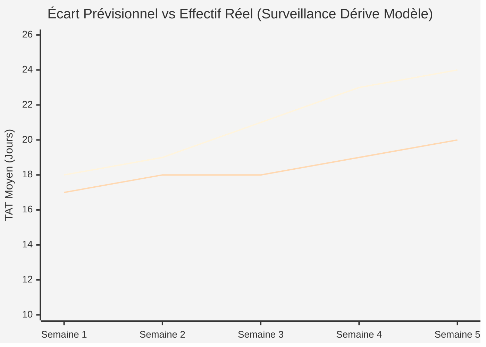

*(Note : Les snippets des illustrations SVG associées sont archivés dans `svg_illustrations.md`).*

---

## Étape 2 : Modèle

> **Question de cadrage :** Quelles tables permettent le calcul selon le niveau de détail unitaire ?  
> **En-tête de l'interface :** Étape 2 : Données (Granularité & Tables pour le calcul)  
> **Bouton d'affichage :** en haut à droite, le bouton `schema-toggle` bascule entre la vue SVG (`schemaCanvas`) et le code Mermaid (`SCHEMA_MERMAID` dans `index.html`, avec bouton dédié « Copier le code » et sélection intégrale sans toast intempestif), identique aux diagrammes `erDiagram` ci-dessous.

### Les 3 Niveaux de Granularité :

#### Option 2.A : Macro — Demande de Visite (`visit`)
- **Granularité :** 1 ligne = 1 visite complète moteur `visit (engine, priority, start, end)`.
- **Transits logistiques :** Forfait logistique global rattaché au moteur.
- **Modélisation relationnelle Canvas :**
  - **Fait central :** `visit` (`id_demande` / `id_visit` commençant par `D-xxxxx`, `id_moteur` / ESN, `priorite`, `date_entree [start]`, `date_livraison`, `id_kit_pieces`, `tat_realise_j`, `derapage_sla_j`, `penalites_eur`).
  - **Dimensions liées (1:N) :** `engine` (type, modele, client), `contract_sla` (client, sla_cible_jours, penalite_jour_eur), `transits` (shop_source, shop_dest, delai_transit_j), `calendar` (date, semaine, ouvre), `engine_parts` (`id_piece_pn` au format `Pxxxxx`, modele_moteur, dispo %, intervalle confiance +/-, lien date start).
  - **Identifiants normalisés (`data.json`) :** Demandes au format `D-xxxxx` (ex: `D-09842`), Pièces au format `Pxxxxx` (ex: `P01125`), clés étrangères alignées avec le schéma de l'Étape 2 (`id_demande`, `id_moteur`, `id_shop`, `id_piece_pn`).

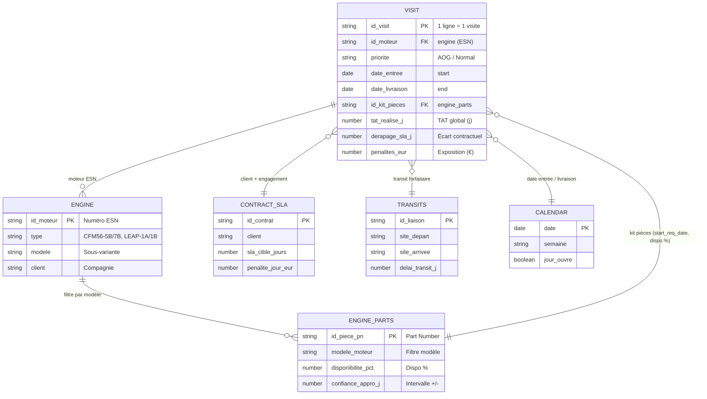

#### Option 2.B : Méso — Réparation par Atelier (`repair`)
- **Granularité :** 1 ligne = 1 réparation module par atelier `repair (type, visit, shop, start, end)`.
- **Transits logistiques :** Navettes physiques mesurées via `durée des transits (shop, shop, length)`.
- **Modélisation relationnelle Canvas :**
  - **Fait central :** `repair` (`id_réparation`, `id_visite`, `id_atelier`, `type_réparation_saisi`, `date_début [start]`, `date_fin`, `id_kit_module`, `tat_atelier_j`, `durée_navette_j`).
  - **Dimensions liées (1:N) :** `visit` (moteur, priorité, client), `shop` (nom, spécialités, postes), `durée des transits` (atelier_source, atelier_dest, délai_transit_j), `calendar`, `engine_parts` (lié par type de réparation).

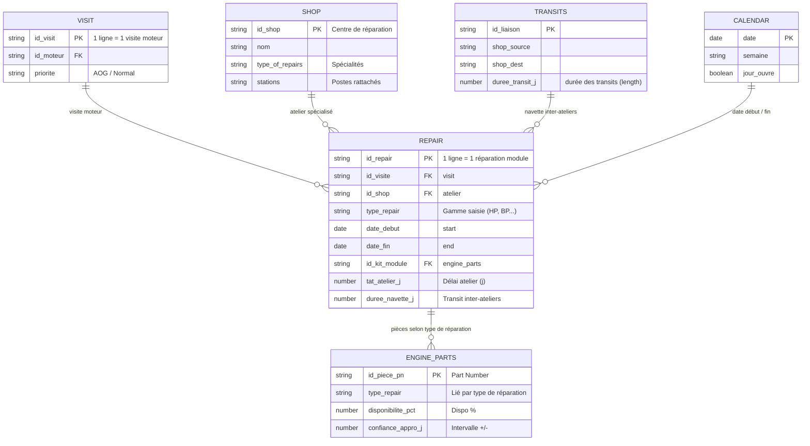

#### Option 2.C : Micro — Tâche sur Poste (`task`)
- **Granularité :** 1 ligne = 1 tâche technique pointée sur poste `task (visit, repair, station, type)`.
- **Référentiel des durées théoriques :** Seule option disposant de la table de référence `durée des tâches (type engine, type task, length)`.
- **Modélisation relationnelle Canvas :**
  - **Fait central :** `task` (`id_pointage_tâche`, `id_visite`, `id_réparation`, `id_poste`, `opération_saisie`, `horodatage_début [start]`, `horodatage_fin`, `id_composant_task`, `durée_pointée_h`).
  - **Dimensions liées (1:N) :** `durée des tâches` (type engine, type task, durée_gamme_h), `station` (atelier, spécialités, seuil saturation 85%), `capacity` (taux d'occupation réel, heures dispo), `schedule` (créneau, shift), `engine_parts` (composant unitaire au poste).


---

## Étape 3 : TAT

> **Question de cadrage :** Quel niveau de complexité mathématique et d'hypothèse adopter ?  
> **En-tête de l'interface :** Étape 3 : Choisir la méthode de calcul du délai (TAT) (`📐 Méthode & Rigueur de Calcul`)

### Les 4 Méthodes de Calcul du TAT :
1. **Option 3.A : Délais théoriques de traitement**
   - *Principe :* Somme arithmétique des temps de gammes standards constructeur et des forfaits logistiques.
   - *Formule DAX :* `SUMX(FAIT, FAIT[Duree_Standard] + FAIT[Transit_Forfait])`
   - ⚠️ **Règle stricte :** Indisponible en Granularité 2.B (bascule automatique sur 3.B).
2. **Option 3.B : Table des délais moyens (5%, 95%, médian)**
   - *Principe :* Distribution empirique réelle ($P_5, P_{50}, P_{95}$) mesurée sur l'historique de passage.
   - *Formule DAX :* `PERCENTILEX.INC(FAIT, FAIT[Duree_Reelle], 0.50)`
3. **Option 3.C : Délais selon le taux d'occupation atelier**
   - *Principe :* Modélisation de l'engorgement des files d'attente à l'approche du seuil critique (85%).
   - *Formule DAX :* `DIVIDE(Temps_Usinage, 1 - RELATED(DIM_SITE[Taux_Charge]))`
4. **Option 3.D : Modélisation avancée**
   - *Principe :* Simulation dynamique probabiliste multi-factorielle contextuelle.
   - *Formule DAX :* `SIMULATE_TAT_ADVANCED(FAIT, CONTEXT)`

### Extraits des Tables Dynamiques d'Atelier (Croisement Granularité × TAT)

#### Extrait A : Demande Macro (visit) × Table des Délais Moyens (3.B)
```text
| id_visit       | engine          | priority | délai à 5% (Opt) | délai médian (50%) | délai à 95% (Pess) | écart_type |
| :------------- | :-------------- | :------- | :--------------- | :----------------- | :----------------- | :--------- |
| VISIT-2024-089 | CFM56-7B (AFR)  | AOG      | 14.5 j           | 18.2 j             | 27.0 j             | 3.8 j      |
| VISIT-2024-094 | LEAP-1A (DLH)   | Standard | 18.0 j           | 22.5 j             | 34.5 j             | 4.2 j      |
| VISIT-2024-102 | CFM56-5B (RYR)  | Standard | 11.0 j           | 14.0 j             | 21.0 j             | 2.5 j      |
```
*Formule DAX associée :* `TAT_Median = PERCENTILEX.INC(visit, [tat_days], 0.50)`

#### Extrait B : Réparation Méso (repair) × Délais selon Taux d'Occupation (3.C)
```text
| repair_id    | type            | shop       | taux_occupation_shop | tps_atelier_hist_j | attente_saturation_j | tat_total_shop |
| :----------- | :-------------- | :--------- | :------------------- | :----------------- | :------------------- | :------------- |
| REP-701-AUB  | Aubes HP        | Montereau  | 72 % (Normal)        | 6.5 j              | + 1.2 j              | 7.7 j          |
| REP-701-COM  | Compresseur BP  | Villaroche | 86 % (Tendu)         | 12.0 j             | + 4.8 j              | 16.8 j         |
| REP-701-TST  | Banc d'Essai    | Bruxelles  | 94 % (Goulot 🚨)     | 2.5 j              | + 7.4 j              | 9.9 j ⚠️       |
```
*Formule DAX associée :* `TAT_Repair_Charge = [shop_history_tat] / (1 - RELATED(shop[taux_occupation]))`

#### Extrait C : Tâche Micro (task) × Délais Théoriques (3.A)
```text
| task_id     | type engine | type task         | station       | durée des tâches (length) | transit_buffer_h | cycle_total_h |
| :---------- | :---------- | :---------------- | :------------ | :------------------------ | :--------------- | :------------ |
| TASK-901-01 | CFM56-7B    | Tournage Carter   | USI-04 (VIL)  | 4.5 h                     | + 1.0 h          | 5.5 h         |
| TASK-901-02 | LEAP-1A     | Ressuage Chimique | CND-02 (MON)  | 2.0 h                     | + 0.5 h          | 2.5 h         |
| TASK-901-03 | LEAP-1B     | Équilibrage Rotor | EQU-01 (VIL)  | 3.5 h                     | + 0.5 h          | 4.0 h         |
```
*Formule DAX associée :* `Duree_Totale_Theorique = SUMX('durée des tâches', [length])`

---

## Étape 4 : Délai

> **Question de cadrage :** Quels visuels utiliser pour piloter les délais et les engagements clients ?  
> **En-tête de l'interface :** Étape 4 : Sélectionner les visuels pour le Délai (TAT) (`📊 Dataviz & Conception Graphique`)
> **Rendu Chart.js (Étape 4) :** Les cartes d'options disposent d'un panneau Chart.js à droite (titres et sous-titres avec description explicite de la mesure et des axes X et Y, canvas `#step-4-canvas`). Les valeurs graphiques sont affichées par défaut sur chaque point, barre ou tranche via `chartjs-plugin-datalabels` (sans nécessiter de survol). Les données sont générées côté client (PRNG seedé `maestro_seed`, persistant) sur la base des libellés de `data.json` avec 10 sites Safran préfixés (`BE-`, `FR-`) et les flottes de moteurs (*CFM56-7B, CFM56-5B, LEAP-1A, LEAP-1B, GE90-115B, M88-2*).

### Les 8 Graphiques Disponibles pour le Délai :
- **4.A : TAT Médian & Bornes 5%-95% par Moteur**  
  *Titre & Sous-titre :* Mesure du TAT Médian et intervalle P5-P95 (j) | Axe X : Modèle Moteur (CFM56-7B, CFM56-5B, LEAP-1A, LEAP-1B, GE90-115B, M88-2) | Axe Y : Durée du TAT (jours).  
  *Rendu :* Distribution statistique avec étiquettes de valeurs par défaut sur les médianes et bornes.  
  *Usages associés :* `Pilotage`, `Gouvernance`.
- **4.B : Décomposition du TAT par Site**  
  *Titre & Sous-titre :* Décomposition du TAT cumulé (j) | Axe X : Site Industriel Safran (10 sites : FR-Villaroche, FR-Montereau, FR-Châtellerault, BE-Bruxelles, FR-Saint-Quentin, FR-Gennevilliers, FR-Bordeaux, FR-Toulouse, BE-Liège, FR-Le Creusot) | Axe Y : Jours cumulés (j).  
  *Rendu :* Barres empilées (Attente, Réparation, Transit) avec affichage systématique des valeurs chiffrées en jours sur chaque segment.  
  *Usages associés :* `Opérationnel`, `Pilotage`, `Logistique`.
- **4.C : Respect des Délais Contractuels par Client & Moteur**  
  *Titre & Sous-titre :* Respect Contractuel et Taux de Dérive SLA (%) | Axe X : Compagnies Aériennes (Air France, Air China, EasyJet, Lufthansa, Delta Air Lines, Emirates, Singapore Airlines) | Axe Y1 : Jours (j) / Axe Y2 : Dérive SLA (%).  
  *Rendu :* Barres groupées et courbe combinée avec étiquettes de valeurs actives en permanence.  
  *Usages associés :* `Contractuel`, `Financier`.
- **4.D : Tableau d'Alertes Nominatives**  
  *Titre & Sous-titre :* Cartographie des Dossiers ESN et Niveaux d'Escalade | Axe X : Moteur / Compagnie | Axe Y : Retard Effectif (jours).  
  *Rendu :* Répartition catégorisée (Conforme, En cours, Retard, AOG critique) avec badges et valeurs associées.  
  *Usages associés :* `Opérationnel`, `Contractuel`, `Financier`.
- **4.E : Cartes KPIs Synthétiques**  
  *Titre & Sous-titre :* Indicateurs Phares Globaux | Métriques : TAT Moyen Réel (j), Taux SLA (%), En-cours Critique.  
  *Rendu :* Cartes métriques scalaires et donut de répartition des statuts avec affichage direct des volumes.  
  *Usages associés :* `Pilotage`, `Contractuel`.
- **4.F : Barres vs Seuils Cibles P85**  
  *Titre & Sous-titre :* Positionnement TAT vs Seuil Tolérance P85 (j) | Axe X : Durée constatée (j) | Axe Y : Modules & Types de Réparation.  
  *Rendu :* Barres horizontales avec seuils cibles et valeurs exactes affichées en bout de barre.  
  *Usages associés :* `Opérationnel`, `Gouvernance`.
- **4.G : Waterfall des Dérives TAT**  
  *Titre & Sous-titre :* Décomposition Cumulative des Dérives TAT (j) | Axe X : Facteurs de Dérive / Étapes | Axe Y : Impact sur le Délai (jours).  
  *Rendu :* Cascade de barres flottantes avec delta chiffré sur chaque composante de retard.  
  *Usages associés :* `Contractuel`, `Financier`, `Gouvernance`.
- **4.H : Jalons de Traversée (Gates)**  
  *Titre & Sous-titre :* Durée de Traversée par Gate Industrielle (G1 à G3) | Axe X : Portes Industrielles | Axe Y : Durée de Passage (jours).  
  *Rendu :* Chronogramme avec valeurs affichées par étape et chemin critique mis en exergue.  
  *Usages associés :* `Opérationnel`, `Pilotage`, `Logistique`.

### Illustrations Graphiques en Mermaid (Étape 4)

#### 1. TAT Médian & Bornes de Dispersion P5 - P95 par Moteur (Illustration 4.A)
```mermaid
gantt
    title TAT Médian (P50) et Intervalle de Dispersion (P5 - P95) par Moteur (Jours)
    dateFormat X
    axisFormat %s j

    section CFM56-7B
    Dispersion P5 - P95 (9.2j à 21j)     :a1, 9, 21
    Médian P50 (14.5j)                   :milestone, m1, 14, 0d

    section LEAP-1A
    Dispersion P5 - P95 (14j à 31.5j)    :crit, a2, 14, 31
    Médian P50 (21.4j)                   :milestone, m2, 21, 0d

    section LEAP-1B
    Dispersion P5 - P95 (11.8j à 27j)    :active, a3, 12, 27
    Médian P50 (18.2j)                   :milestone, m3, 18, 0d
```

#### 2. Décomposition du TAT par Site Industriel (Illustration 4.B)
```mermaid
%%{init: {'theme': 'base', 'themeVariables': { 'primaryColor': '#3b82f6'}}}%%
xychart-beta
    title "Décomposition du TAT (Jours) par Site Safran : Réparation vs Navette vs Attente"
    x-axis ["FR-Villaroche", "FR-Montereau", "FR-Châtellerault", "BE-Bruxelles", "FR-St-Quentin", "FR-Gennevilliers", "FR-Bordeaux"]
    y-axis "Jours cumulés" 0 --> 25
    bar [11, 10, 12, 10, 11, 13, 12]
    bar [3, 4, 2, 3, 2, 3, 2]
    bar [4, 7, 3, 3, 4, 5, 4]
```

#### 3. Respect des Délais Contractuels vs Effectifs par Client (Illustration 4.C)
```mermaid
%%{init: {'theme': 'base'}}%%
xychart-beta
    title "Écart TAT Contractuel vs Effectif et Taux de Non-Respect SLA (%)"
    x-axis ["Air France", "Air China", "EasyJet", "Lufthansa", "Delta Air Lines", "Emirates", "Singapore Airlines"]
    y-axis "TAT Moyen (Jours)" 0 --> 25
    bar [20, 18, 22, 16, 21, 19, 23]
    bar [19, 17, 22, 19, 20, 18, 21]
    line [5, 4, 6, 15, 8, 5, 4]
```

#### 4. Logigramme d'Escalade et Qualification des Statuts ESN (Illustration 4.D)
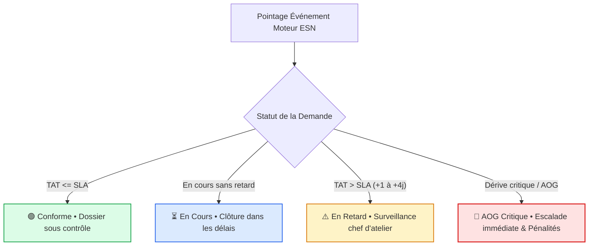

---

## Étape 5 : Capacité

> **Question de cadrage :** Sur quelle base dimensionner et projeter la capacité des ateliers ?  
> **En-tête de l'interface :** Étape 5 : Choisir la méthode d'évaluation de la Capacité Atelier (`⚖️ Modélisation du Capacitaire`)

### Les 4 Méthodes d'Évaluation de la Capacité :
1. **Option 5.A : Prévisions des Demandes (Plan S&OP)**
   - *Principe :* Croisement des déposes annoncées par les compagnies à 3-6 mois et des créneaux de baies réservés.
   - *Formule DAX :* `Charge_Prevue_SOP = SUM(prevision_visit[visites_fermes]) / [capacité_mensuelle]`
2. **Option 5.B : Demandes Effectives à l'Instant (WIP Réel)**
   - *Principe :* Photographie exacte des moteurs et lots physiquement présents sur plancher et pointés en direct.
   - *Formule DAX :* `Taux_Occupation_Live = DIVIDE(COUNTROWS(FILTER(visit, ISBLANK([date_end]))), [capacité_baies])`
3. **Option 5.C : Capacité & Approvisionnement Pièces**
   - *Principe :* Débit d'atelier directement contraint par la disponibilité des kits de rechange (OTIF) et les délais OEM.
   - *Formule DAX :* `Debit_Visite_Pieces = MIN([Capacite_Baies], [Kits_OTIF_Disponibles])`
4. **Option 5.D : Prévisions Multi-factorielles (Réalité MRO)**
   - *Principe :* Simulation probabiliste intégrant rebuts aux contrôles CND/ressuage, créneaux bancs et usure des pièces LLP.
   - *Formule DAX :* `Demande_Predictive_MRO = FORECAST_MRO(cycles_tsn_csn, rebuts_cnd, banc_slots, llp_attrition)`

### Extraits des Vues Capacitaires d'Atelier (Croisement Granularité × Capacité)

#### Extrait A : Visite Macro (visit) × Prévisions S&OP (5.A)
```text
| engine type | mois_cible     | visites_annoncées (S&OP) | créneaux_réservés | couverture_plan         |
| :---------- | :------------- | :----------------------- | :---------------- | :---------------------- |
| CFM56       | M+1 (Octobre)  | 14 visites fermes        | 12 slots          | 116.7 % (Déficit 🚨)    |
| LEAP-1A     | M+1 (Octobre)  | 7 visites fermes         | 8 slots           | 87.5 % (OK)             |
| LEAP-1B     | M+1 (Octobre)  | 5 visites fermes         | 6 slots           | 83.3 % (OK)             |
```
*Formule DAX associée :* `Charge_Prevue_SOP = SUM(prevision_visit[visites_fermes]) / [capacité_mensuelle]`

#### Extrait B : Réparation Méso (repair) × WIP Instantané d'Atelier (5.B)
```text
| shop (atelier)    | type of repairs  | lots_repair_wip | durée des transits (en cours) | taux_occupation |
| :---------------- | :--------------- | :-------------- | :---------------------------- | :-------------- |
| FR-Montereau      | Aubes Turbine HP | 22 lots actifs  | 3 navettes route              | 91.7 % ⚠️       |
| FR-Villaroche     | Compresseurs     | 11 lots actifs  | 1 navette route               | 68.8 %          |
| BE-Bruxelles      | Banc d'Essai     | 10 lots actifs  | 2 en attente quai             | 100.0 % 🚨      |
| FR-Saint-Quentin  | Éléments Chauds  | 8 lots actifs   | 1 navette route               | 78.4 %          |
```
*Formule DAX associée :* `Occupation_Shop_Live = DIVIDE(COUNTROWS(FILTER(repair, ISBLANK([end]))), [capacité_lots_hebdo])`

#### Extrait C : Tâche Micro (task) × Approvisionnement Pièces au Poste (5.C)
```text
| station [poste]       | composants_requis            | disponibilité_bacs_tampons | manquants_poste         | temps_attente_induit |
| :-------------------- | :--------------------------- | :------------------------- | :---------------------- | :------------------- |
| USI-04 (5-Axes)       | Plaquettes carbure & fraises | 96 %                       | 0 rupture               | 0.0 h                |
| CND-02 (Ressuage)     | Kits éprouvettes ressuage    | 98 %                       | 0 rupture               | 0.0 h                |
| EQU-01 (Équilibrage)  | Masselottes d'équilibrage    | 75 %                       | 3 références en rupture | +6.5 h attente ⚠️    |
```
*Formule DAX associée :* `Attente_Pieces_Poste = SUMX(task, [heures_arret_manquant])`

---

## Étape 6 : Saturation

> **Question de cadrage :** Quels visuels choisir pour repérer les goulots d'étranglement et la surcharge ?  
> **En-tête de l'interface :** Étape 6 : Sélectionner les visuels pour la Saturation des Ateliers (`📊 Dataviz & Conception Graphique`)
> **Rendu Chart.js (Étape 6) :** Les cartes d'options disposent d'un panneau Chart.js à droite (titres et sous-titres avec description explicite de la mesure et des axes X et Y, canvas `#step-6-canvas`). Les valeurs graphiques sont affichées par défaut sur chaque point, barre ou tranche via `chartjs-plugin-datalabels` (sans nécessiter de survol). Les données sont générées côté client (PRNG seedé `maestro_seed`, persistant) sur la base des libellés de `data.json` avec 7 sites Safran préfixés (`BE-`, `FR-`) et les vraies compagnies aériennes.

### Les 8 Graphiques de Saturation :
- **6.A : Top Pièces Manquantes par Site**  
  *Titre & Sous-titre :* Heures d'Attente Induites par les Pièces Manquantes (h) | Axe X : Références Pièces Critiques (Aubes HP, Disques LLP, etc.) | Axe Y : Heures d'attente cumulées (h).  
  *Rendu :* Barres avec affichage permanent des heures d'attente cumulées sur chaque barre.  
  *Usages associés :* `Logistique`, `Opérationnel`.
- **6.B : Retards par Réparation & Moteur**  
  *Titre & Sous-titre :* Taux de Retard par Type de Réparation et Flotte Moteur (%) | Axe X : Typologie de Réparation | Axe Y : % de Dossiers Décalés (%).  
  *Rendu :* Barres groupées CFM56 vs LEAP avec pourcentages affichés par défaut.  
  *Usages associés :* `Opérationnel`, `Gouvernance`.
- **6.C : Top Routes de Transfert Inter-Sites**  
  *Titre & Sous-titre :* Flux Navettes et Délais de Transfert Inter-Sites | Axe X : Axes Logistiques Inter-Sites | Axe Y1 : % du Flux Global / Axe Y2 : Délai Moyen Navette (j).  
  *Rendu :* Barres de volume de flux combinées à la courbe des délais avec valeurs visibles sur chaque point et barre.  
  *Usages associés :* `Logistique`, `Pilotage`.
- **6.D : Ratio Attente vs Travail Effectif**  
  *Titre & Sous-titre :* Répartition du Lead Time Global Atelier (Lean MRO) | Donut : Travail VA, Attente pièces, Transferts navettes.  
  *Rendu :* Donut Lean avec étiquettes de pourcentages et d'heures affichées directement sur chaque segment.  
  *Usages associés :* `Pilotage`, `Gouvernance`.
- **6.E : Barres de Charge vs Seuil 85%**  
  *Titre & Sous-titre :* Taux de Charge Atelier vs Seuil Critique 85% (%) | Axe X : Centres Industriels Safran | Axe Y : Taux d'Occupation Réel (%).  
  *Rendu :* Barres de charge avec coloration d'alerte et étiquette du taux d'occupation exact par site.  
  *Usages associés :* `Opérationnel`, `Pilotage`.
- **6.F : Heatmap Hebdomadaire / Site**  
  *Titre & Sous-titre :* Matrice d'Intensité Hebdomadaire de Charge (%) | Axe X : Semaines Calendaires (S1 à S8) | Axe Y : Sites Safran (7 centres).  
  *Rendu :* Matrice thermique avec affichage des taux de charge moyens par site.  
  *Usages associés :* `Pilotage`, `Opérationnel`.
- **6.G : Courbes Entrées vs Sorties WIP**  
  *Titre & Sous-titre :* Cumulative Flow Diagram - Entrées vs Sorties WIP (unités) | Axe X : Semaines Calendaires (S1 à S6) | Axe Y : Volumes Cumulés (moteurs).  
  *Rendu :* Courbes d'accumulation avec volumes visibles par défaut sur chaque jalon hebdomadaire.  
  *Usages associés :* `Logistique`, `Financier`, `Gouvernance`.
- **6.H : Treemap des Goulots d'Atelier**  
  *Titre & Sous-titre :* En-cours Cumulé et Taux de Saturation par Poste Critique | Axe X : En-cours Cumulé WIP (heures) | Axe Y : Postes & Machines d'Atelier.  
  *Rendu :* Barres horizontales avec étiquettes détaillées `[WIP h (Saturation %)]` affichées en bout de ligne.  
  *Usages associés :* `Opérationnel`, `Pilotage`, `Logistique`.

### Illustrations Graphiques en Mermaid (Étape 6)

#### 1. Top des Pièces Manquantes Causant l'Attente par Site (Illustration 6.A)
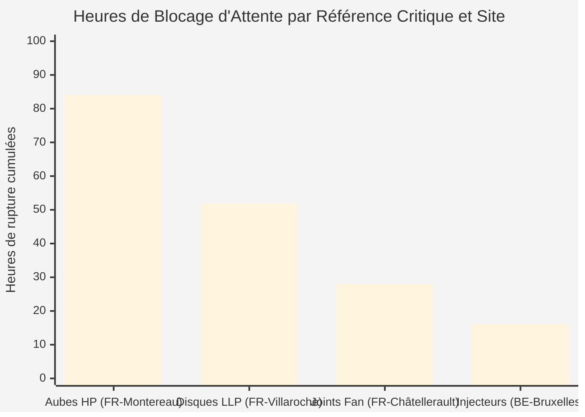

#### 2. Dérive et Retard par Type d'Opération Atelier et Moteur (Illustration 6.B)
```mermaid
%%{init: {'theme': 'base'}}%%
xychart-beta
    title "Part des Demandes Subissant un Aléa Imprévu (% Retard) : CFM56 vs LEAP"
    x-axis ["Usinage Carter Fan", "Ressuage CND", "Revêtement Aubes HP", "Recette Banc d'Essais"]
    y-axis "% Demandes Décalées" 0 --> 35
    bar [18, 14, 12, 8]
    bar [29, 24, 26, 17]
```

#### 3. Top des Routes de Sous-Traitance et Délais Navettes (Illustration 6.C)
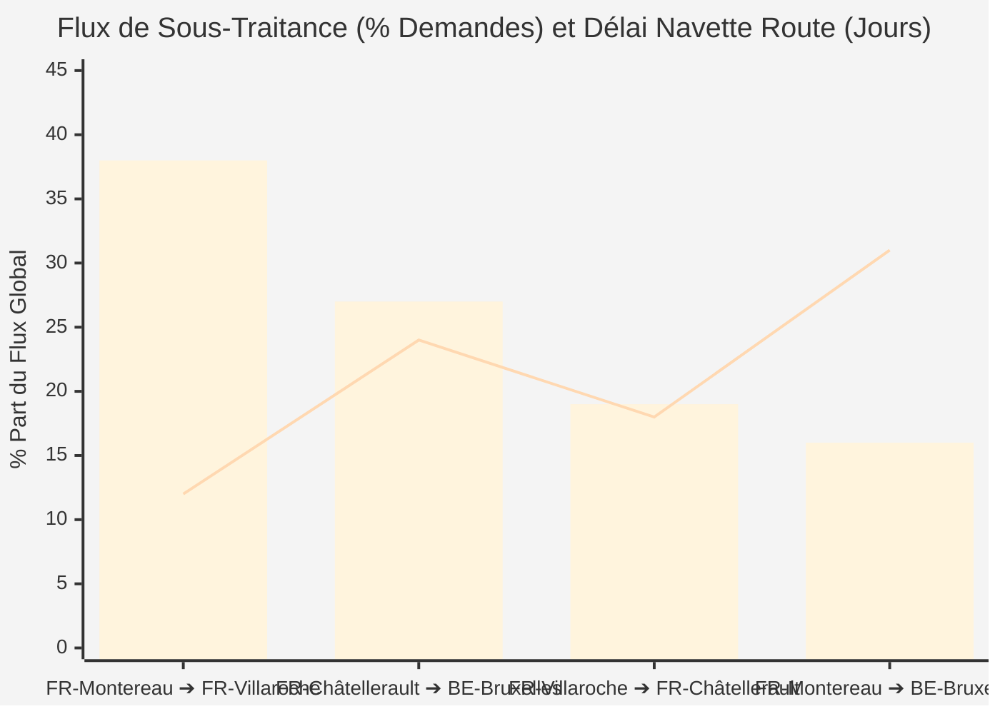

#### 4. Donut Lean : Temps Contact vs Temps d'Attente (Illustration 6.D)
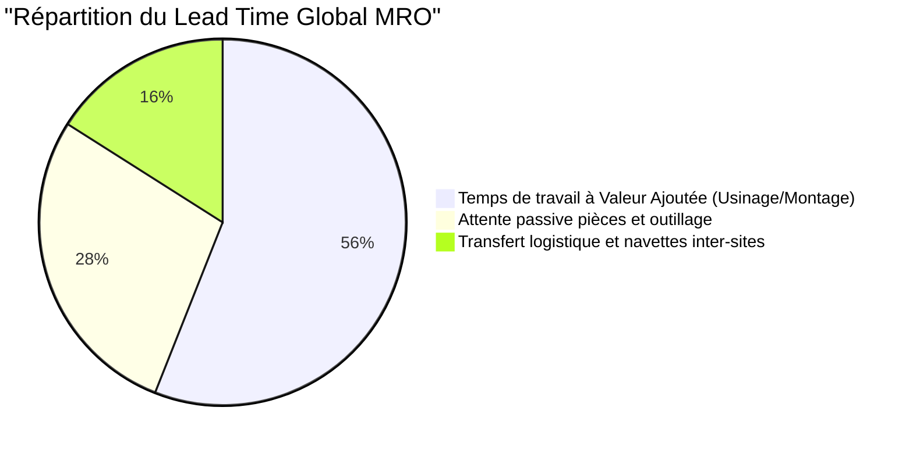

---

## Étape 7 : Synthèse, Profils & Dashboard Dérivé

> **Question de cadrage :** Comment structurer la restitution finale pour engager les parties prenantes ?  
> **En-tête de l'interface :** Étape 7 : Slide de Synthèse Décisionnel & Dashboard Projeté (`✨ Fiche Architecture`)

### Fonctionnalités Clés du Slide Décisionnel :
1. **Dropdowns Interactifs Synchronisés (`#select-q1` à `#select-q6`) :**
   Permettent de modifier instantanément un choix sans devoir reboucler les étapes antérieures.
2. **Barre de Filtres Multidimensionnelle Dynamique :**
   - *Filtre Site (10 sites) :* Tous, FR-Villaroche (VIL), FR-Montereau (MON), FR-Châtellerault (CHL), BE-Bruxelles (BRU), FR-Saint-Quentin (SQY), FR-Gennevilliers (GEN), FR-Bordeaux (BDX), FR-Toulouse (TLS), BE-Liège (LGG), FR-Le Creusot (CRE).
   - *Filtre Client (Vraies compagnies) :* Toutes compagnies, Air France (AFR), Air China (CCA), EasyJet (EZY), Lufthansa (DLH), Delta Air Lines (DAL), Emirates (UAE), Singapore Airlines (SIA).
   - *Filtre Moteur (6 flottes) :* CFM56-7B, CFM56-5B, LEAP-1A, LEAP-1B, GE90-115B, M88-2.
   - *Filtre Date Calendaire Jour :* Sélecteur de date d'entrée prédictive couplé au calcul automatique de la **Date Prévisionnelle de restitution** (`Date + TAT Médian`).
3. **Quatuor de Cartes KPIs Dynamiques :**
   - KPI 1 : Dérive métier selon l'objectif Q1 (ex: AOG critiques, pénalités financières encourues, % SLA).
   - KPI 2 : Suivi opérationnel (dossiers en sursis, livraisons conformes, kits en rupture).
   - KPI 3 : TAT moyen glissant et bornes de dispersion $P_5 - P_{95}$ (selon Q3).
   - KPI 4 : Taux de charge et certitude d'adéquation capacitaire (selon Q5).
4. **Visualisations Temps Réel Croisées :**
   - Cadre gauche : Visualisation du délai calibrée selon l'option choisie en Étape 4 (de 4.A à 4.H) avec axes explicites et valeurs par défaut.
   - Cadre droit : Visualisation de la saturation calibrée selon l'option choisie en Étape 6 (de 6.A à 6.H) avec axes explicites et valeurs par défaut.
5. **Recommandations d'Architecture BI & Mesures DAX Déduites :**
   - Formulations automatiques suggérant les colonnes calculées, les liens d'étoile avec le calendrier industriel ouvré et les règles de partitionnement DirectQuery / Import selon la combinaison `[Q1, Q2, Q3, Q4, Q5, Q6]`.

---

## Stratégie de Génération de Données & Moteur Pseudo-Aléatoire Seedé

Cette section formalise la stratégie d'ingénierie des données et de mock dynamique déployée dans Maestro, garantissant à la fois **l'indépendance de la structure**, **la reproductibilité des tests** et **la cohérence physique des indicateurs**.

### 1. Découplage Structure vs Métriques Chiffrées
Afin d'assurer une étanchéité totale entre la nomenclature métier et les calculs dynamiques :
- **`data.json` ne contient AUCUN chiffre figé :** il agit comme un catalogue de référence déclarant uniquement les dimensions, entités réelles (10 sites Safran MRO, 7 compagnies aériennes réelles, 6 familles moteurs, références de pièces au format `Pxxxxx`, demandes au format `D-xxxxx`) et liens structurels.
- **Les visualisations Chart.js sont alimentées à chaud :** les séries temporelles, percentiles, pourcentages de saturation et matrices de charge sont instanciés dynamiquement en mémoire via la fonction `buildMaestroData(base)`.

```text
┌─────────────────────────┐       ┌──────────────────────────────┐
│       data.json         │       │    Mulberry32 (PRNG Seed)    │
│  (Structure & Entités)  │       │   (Reproductibilité session) │
└────────────┬────────────┘       └──────────────┬───────────────┘
             │                                   │
             └───────────────┬───────────────────┘
                             ▼
                 ┌───────────────────────┐
                 │  buildMaestroData()   │
                 │ (Règles de Cohérence) │
                 └───────────┬───────────┘
                             ▼
                 ┌───────────────────────┐
                 │ Tableaux & Graphiques │
                 │ (Chart.js 4.4 + DAX)  │
                 └───────────────────────┘
```

### 2. Reproductibilité & Stabilité par PRNG Seedé (`Mulberry32`)
Pour éviter le clignotement des valeurs d'une interaction à l'autre tout en permettant des variations contrôlées :
- L'algorithme pseudo-aléatoire **Mulberry32** (générateur 32 bits rapide et uniforme) est initialisé avec une graine (`seed`) fixe (valeur par défaut : `42`).
- Cette graine est persistée dans le `localStorage` du navigateur (`maestro_seed`).
- **Bénéfice didactique :** un utilisateur ou formateur retrouve exactement le même jeu d'essai lors d'une démonstration, tout en pouvant régénérer un jeu alternatif cohérent via `resetFilters()`.

### 3. Règles de Cohérence Physique Industrielle MRO
Le moteur de mock applique un ensemble d'invariants mathématiques et opérationnels pour garantir la crédibilité décisionnelle :

1. **Hiérarchie Stricte des Percentiles ($P_5 < P_{50} < P_{95}$) :**
   - La médiane $P_{50}$ est calibrée sur le standard constructeur de la famille moteur (ex: ~14.9j pour CFM56-7B, ~21.6j pour LEAP-1A, ~26.2j pour GE90-115B).
   - La borne basse $P_5$ est contrainte entre 60% et 70% de la médiane ($P_{50}$).
   - La borne haute $P_{95}$ est contrainte entre 140% et 165% de la médiane ($P_{50}$).
2. **Décomposition Additive du TAT (100% du délai total) :**
   - Pour chaque site, le TAT global décomposé respecte : $\text{TAT} = \text{Réparation (9 à 12.5j)} + \text{Attente (2.5 à 7j)} + \text{Transfert Navette (1.5 à 4j)}$.
3. **Statut d'Urgence et Modélisation des Pénalités Financières :**
   - Un dossier `Conforme` a un retard contractuel nul ($\Delta_{\text{SLA}} = 0$).
   - Un dossier `En Retard` subit un retard de 2 à 5 jours.
   - Un dossier `AOG Critique` subit un retard sévère de 8 à 18 jours.
   - Les pénalités financières encourues sont mathématiquement calculées par la formule :
     $$\text{Pénalités (€)} = \text{Retard (jours)} \times \text{Barème journalier contractuel (1 500 € à 2 500 € / j)}$$
4. **Détection des Goulots d'Atelier & Seuil Critique de 85% :**
   - Les heures de rupture de stock sont directement proportionnelles au statut de criticité du composant (Critique : 55 à 90h, Modéré : 30 à 55h, Veille : 10 à 30h).
   - Les îlots et machines dont la charge dépasse 85% déclenchent automatiquement un code couleur ambre/rouge sur les jauges et la heatmap 2D (Étape 6.F).

### 4. Guide de Transposition à un Autre Domaine Métier
Pour injecter des données d'un autre secteur industriel (ex: ferroviaire ou naval) :
1. Remplacer les entités de `data.json` par vos matériels, centres techniques et clients.
2. Ajuster l'objet `p50Base` dans `index.html` avec les durées nominales de vos interventions.
3. Conserver le moteur `buildMaestroData()` : il propagera automatiquement des données chiffrées cohérentes, plausibles et visuellement démonstratives dans l'ensemble des 8 visualisations de délai et 8 visualisations de charge.

