# MAESTRO - Référentiel des Contenus & Cadrage Métier MRO

Ce document constitue le référentiel textuel, méthodologique et technique synchronisé avec l'application SPA `index.html`. Il rassemble le contexte opérationnel, les enjeux de gouvernance des données, les descriptions fonctionnelles, les représentations graphiques Mermaid ainsi que les extraits des tables dynamiques et formules DAX.

---

## Sommaire
- [Étape 0 : Contexte & Documentation](#étape-0--contexte--documentation)
- [Étape 1 : Question (Cadrage métier prioritaire)](#étape-1--question)
- [Étape 2 : Modèle (Granularité & Tables de calcul)](#étape-2--modèle)
- [Étape 3 : TAT (Méthode de calcul du Turn Around Time)](#étape-3--tat)
- [Étape 4 : Délai (Visualisations & Alertes TAT)](#étape-4--délai)
- [Étape 5 : Capacité (Méthode d'évaluation de la Capacité Atelier)](#étape-5--capacité)
- [Étape 6 : Saturation (Visualisations de la Charge Atelier)](#étape-6--saturation)
- [Étape 7 : Synthèse, Profils & Dashboard Dérivé](#étape-7--synthèse-profils--dashboard-dérivé)

---

## Étape 0 : Contexte & Documentation

> **En-tête de l'interface :** Étape 0 : Contexte & Documentation  
> **Comportement :** La page Étape 0 charge et affiche le contenu des fichiers Markdown du dossier racine via un sélecteur en haut (`readme.md` par défaut, puis `content.md`, `AGENTS.md`, `svg_illustrations.md`).

### 0.1 Contenu par défaut (readme.md)
Le fichier `readme.md`, affiché par défaut, porte le **contexte opérationnel** et le **rôle du consultant / data lead supervisor** :
- **Contexte Opérationnel & Déploiement BI :** Déploiement d'un outil décisionnel Power BI de cadrage de charge et de pilotage du TAT sur les flottes CFM56-5B/7B, LEAP-1A, LEAP-1B, dans une démarche d'amélioration continue, de discovery métier et de fiabilisation algorithmique.
- **Rôle & Enjeux du Consultant / Data Lead Supervisor :** Arbitrage de la source de vérité (Golden Source), supervision de la qualité et du cycle de vie des données, normalisation des règles de calcul (Data Dictionary) et éthique de restitution (RLS/RBAC).

> *(La **Méthodologie Data & Gouvernance** reste détaillée dans les guides méthodologiques des étapes 1 à 6 du simulateur.)*

---

## Étape 1 : Question

> **Question de cadrage :** Quel est le premier problème que le tableau de bord doit résoudre ?  
> **En-tête de l'interface :** Étape 1 : Cadrer la question métier prioritaire (`🎯 Cadrage du Persona Métier`)

### Options Décisionnelles Disponibles :
1. **Option 1.A : Urgence opérationnelle (AOG)**
   - *Sous-titre :* Alerte temps réel AOG & escalade immédiate
   - *Description :* Alerter en direct sur les moteurs à risque d'immobilisation avion (**AOG**). Escalade immédiate vers les chefs d'atelier dès dérive critique.
   - *Orientation de restitution :* Badges d'alerte rouge clignotant, identification des ESN en souffrance.
2. **Option 1.B : Engagements contractuels (SLA)**
   - *Sous-titre :* Respect des SLA & vision globale par compagnie
   - *Description :* Garantir le respect des **SLA** et du TAT moyen par compagnie aérienne et typologie de contrat.
   - *Orientation de restitution :* Jauges de conformité contractuelle, décompte des dossiers livrés dans les temps.
3. **Option 1.C : Optimisation des capacités**
   - *Sous-titre :* Lissage de charge & élimination des goulets ateliers
   - *Description :* Équilibrer les charges multi-sites (Montereau, Villaroche, Bruxelles), lisser les goulets et l'usinage.
   - *Orientation de restitution :* Comparatif capacitaire inter-sites et détection des îlots saturés.
4. **Option 1.D : Suivi Retard & Pénalités**
   - *Sous-titre :* Dérapage en jours ouvrés & exposition financière (€)
   - *Description :* Mesurer le dérapage en **jours ouvrés** au-delà du SLA et chiffrer l'exposition financière (€).
   - *Orientation de restitution :* Exposition financière cumulée, compteurs d'ESN sous pénalités journalières.
5. **Option 1.E : Logistique et Approvisionnement**
   - *Sous-titre :* Disponibilité stock, délais fournisseurs et kits complets
   - *Description :* Suivre les pièces en stock, les délais fournisseurs et éliminer les ruptures bloquant la réparation.
   - *Orientation de restitution :* Taux de service OTIF, détection des kits incomplets (aubes HP, LLP).
6. **Option 1.F : Data Gouvernance**
   - *Sous-titre :* Suivi des usages métiers, fiabilisation & pertinence des modèles
   - *Description :* Suivre les usages métiers, fiabiliser la donnée et s'assurer de la pertinence des modèles en mesurant l'écart prévisionnel vs effectif.
   - *Orientation de restitution :* Dérive des algorithmes, contrôle qualité des tables et suivi de l'adoption décisionnelle.

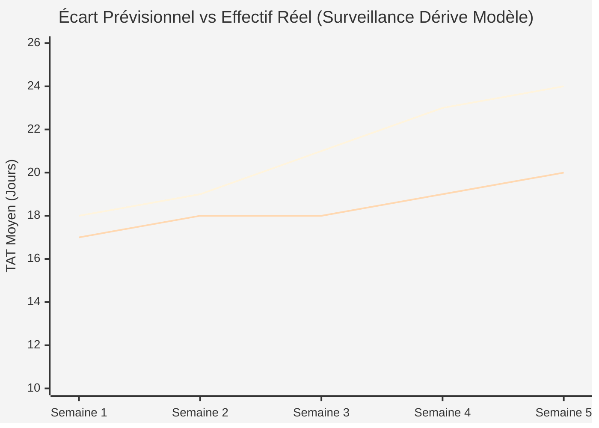

*(Note : Les snippets des illustrations SVG associées sont archivés dans `svg_illustrations.md`).*

---

## Étape 2 : Modèle

> **Question de cadrage :** Quelles tables permettent le calcul selon le niveau de détail unitaire ?  
> **En-tête de l'interface :** Étape 2 : Données (Granularité & Tables pour le calcul)  
> **Bouton d'affichage :** en haut à droite, le bouton `schema-toggle` bascule entre la vue SVG (`schemaCanvas`) et le code Mermaid (`SCHEMA_MERMAID` dans `index.html`), identique aux diagrammes `erDiagram` ci-dessous.

### Les 3 Niveaux de Granularité :

#### Option 2.A : Macro — Demande de Visite (`visit`)
- **Granularité :** 1 ligne = 1 visite complète moteur `visit (engine, priority, start, end)`.
- **Transits logistiques :** Forfait logistique global rattaché au moteur.
- **Modélisation relationnelle Canvas :**
  - **Fait central :** `visit` (`id_visit`, `id_moteur`, `priorité_saisie`, `date_entrée [start]`, `date_livraison`, `id_kit_pièces`, `tat_réalisé_j`, `dérapage_sla_j`, `pénalités_eur`).
  - **Dimensions liées (1:N) :** `engine` (type, modèle, client), `contract_sla` (client, sla_cible_jours, pénalité_jour_eur), `transits` (site_départ, site_arrivée, délai_transit_j), `calendar` (date, semaine, ouvré), `engine_parts` (modèle_moteur, dispo %, intervalle confiance +/-, lien date start).

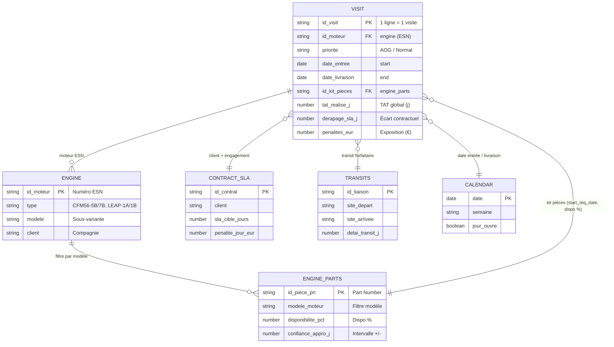

#### Option 2.B : Méso — Réparation par Atelier (`repair`)
- **Granularité :** 1 ligne = 1 réparation module par atelier `repair (type, visit, shop, start, end)`.
- **Transits logistiques :** Navettes physiques mesurées via `durée des transits (shop, shop, length)`.
- **Modélisation relationnelle Canvas :**
  - **Fait central :** `repair` (`id_réparation`, `id_visite`, `id_atelier`, `type_réparation_saisi`, `date_début [start]`, `date_fin`, `id_kit_module`, `tat_atelier_j`, `durée_navette_j`).
  - **Dimensions liées (1:N) :** `visit` (moteur, priorité, client), `shop` (nom, spécialités, postes), `durée des transits` (atelier_source, atelier_dest, délai_transit_j), `calendar`, `engine_parts` (lié par type de réparation).

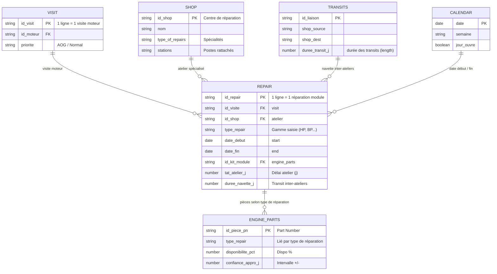

#### Option 2.C : Micro — Tâche sur Poste (`task`)
- **Granularité :** 1 ligne = 1 tâche technique pointée sur poste `task (visit, repair, station, type)`.
- **Référentiel des durées théoriques :** Seule option disposant de la table de référence `durée des tâches (type engine, type task, length)`.
- **Modélisation relationnelle Canvas :**
  - **Fait central :** `task` (`id_pointage_tâche`, `id_visite`, `id_réparation`, `id_poste`, `opération_saisie`, `horodatage_début [start]`, `horodatage_fin`, `id_composant_task`, `durée_pointée_h`).
  - **Dimensions liées (1:N) :** `durée des tâches` (type engine, type task, durée_gamme_h), `station` (atelier, spécialités, seuil saturation 85%), `capacity` (taux d'occupation réel, heures dispo), `schedule` (créneau, shift), `engine_parts` (composant unitaire au poste).

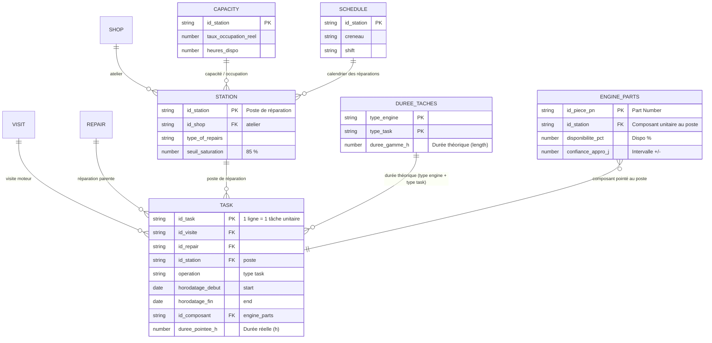

---

## Étape 3 : TAT

> **Question de cadrage :** Quel niveau de complexité mathématique et d'hypothèse adopter ?  
> **En-tête de l'interface :** Étape 3 : Choisir la méthode de calcul du délai (TAT) (`📐 Méthode & Rigueur de Calcul`)

### Les 4 Méthodes de Calcul du TAT :
1. **Option 3.A : Délais théoriques de traitement**
   - *Principe :* Somme arithmétique des temps de gammes standards constructeur et des forfaits logistiques.
   - *Formule DAX :* `SUMX(FAIT, FAIT[Duree_Standard] + FAIT[Transit_Forfait])`
   - ⚠️ **Règle stricte :** Indisponible en Granularité 2.B (bascule automatique sur 3.B).
2. **Option 3.B : Table des délais moyens (5%, 95%, médian)**
   - *Principe :* Distribution empirique réelle ($P_5, P_{50}, P_{95}$) mesurée sur l'historique de passage.
   - *Formule DAX :* `PERCENTILEX.INC(FAIT, FAIT[Duree_Reelle], 0.50)`
3. **Option 3.C : Délais selon le taux d'occupation atelier**
   - *Principe :* Modélisation de l'engorgement des files d'attente à l'approche du seuil critique (85%).
   - *Formule DAX :* `DIVIDE(Temps_Usinage, 1 - RELATED(DIM_SITE[Taux_Charge]))`
4. **Option 3.D : Modélisation avancée**
   - *Principe :* Simulation dynamique probabiliste multi-factorielle contextuelle.
   - *Formule DAX :* `SIMULATE_TAT_ADVANCED(FAIT, CONTEXT)`

### Extraits des Tables Dynamiques d'Atelier (Croisement Granularité × TAT)

#### Extrait A : Demande Macro (visit) × Table des Délais Moyens (3.B)
```text
| id_visit       | engine          | priority | délai à 5% (Opt) | délai médian (50%) | délai à 95% (Pess) | écart_type |
| :------------- | :-------------- | :------- | :--------------- | :----------------- | :----------------- | :--------- |
| VISIT-2024-089 | CFM56-7B (AFR)  | AOG      | 14.5 j           | 18.2 j             | 27.0 j             | 3.8 j      |
| VISIT-2024-094 | LEAP-1A (DLH)   | Standard | 18.0 j           | 22.5 j             | 34.5 j             | 4.2 j      |
| VISIT-2024-102 | CFM56-5B (RYR)  | Standard | 11.0 j           | 14.0 j             | 21.0 j             | 2.5 j      |
```
*Formule DAX associée :* `TAT_Median = PERCENTILEX.INC(visit, [tat_days], 0.50)`

#### Extrait B : Réparation Méso (repair) × Délais selon Taux d'Occupation (3.C)
```text
| repair_id    | type            | shop       | taux_occupation_shop | tps_atelier_hist_j | attente_saturation_j | tat_total_shop |
| :----------- | :-------------- | :--------- | :------------------- | :----------------- | :------------------- | :------------- |
| REP-701-AUB  | Aubes HP        | Montereau  | 72 % (Normal)        | 6.5 j              | + 1.2 j              | 7.7 j          |
| REP-701-COM  | Compresseur BP  | Villaroche | 86 % (Tendu)         | 12.0 j             | + 4.8 j              | 16.8 j         |
| REP-701-TST  | Banc d'Essai    | Bruxelles  | 94 % (Goulot 🚨)     | 2.5 j              | + 7.4 j              | 9.9 j ⚠️       |
```
*Formule DAX associée :* `TAT_Repair_Charge = [shop_history_tat] / (1 - RELATED(shop[taux_occupation]))`

#### Extrait C : Tâche Micro (task) × Délais Théoriques (3.A)
```text
| task_id     | type engine | type task         | station       | durée des tâches (length) | transit_buffer_h | cycle_total_h |
| :---------- | :---------- | :---------------- | :------------ | :------------------------ | :--------------- | :------------ |
| TASK-901-01 | CFM56-7B    | Tournage Carter   | USI-04 (VIL)  | 4.5 h                     | + 1.0 h          | 5.5 h         |
| TASK-901-02 | LEAP-1A     | Ressuage Chimique | CND-02 (MON)  | 2.0 h                     | + 0.5 h          | 2.5 h         |
| TASK-901-03 | LEAP-1B     | Équilibrage Rotor | EQU-01 (VIL)  | 3.5 h                     | + 0.5 h          | 4.0 h         |
```
*Formule DAX associée :* `Duree_Totale_Theorique = SUMX('durée des tâches', [length])`

---

## Étape 4 : Délai

> **Question de cadrage :** Quels visuels utiliser pour piloter les délais et les engagements clients ?  
> **En-tête de l'interface :** Étape 4 : Sélectionner les visuels pour le Délai (TAT) (`📊 Dataviz & Conception Graphique`)

### Les 8 Graphiques Disponibles pour le Délai :
- **4.A : TAT Médian & Bornes 5%-95% par Moteur** (Distribution statistique en boxplot avec valeur médiane $P_{50}$ et bornes $P_{5} - P_{95}$ pour CFM56-7B, LEAP-1A, LEAP-1B).  
  *Usages prépondérants associés :* `Pilotage`, `Gouvernance`.
- **4.B : Décomposition du TAT par Site** (Barres empilées par centre industriel : part d'attente passive, réparation atelier et transferts navettes).  
  *Usages prépondérants associés :* `Opérationnel`, `Pilotage`, `Logistique`.
- **4.C : Respect des Délais Contractuels par Client & Moteur** (Barres groupées comparant TAT contractuel vs TAT effectif couplées au % de non-respect SLA).  
  *Usages prépondérants associés :* `Contractuel`, `Financier`.
- **4.D : Tableau d'Alertes Nominatives** (Listing matriciel ESN avec statut de la demande : AOG critique, En Retard, En Cours, Conforme).  
  *Usages prépondérants associés :* `Opérationnel`, `Contractuel`, `Financier`.
- **4.E : Cartes KPIs Synthétiques** (Indicateurs phares scalaires : TAT moyen réel glissant, taux de respect SLA global et dérive d'en-cours).  
  *Usages prépondérants associés :* `Pilotage`, `Contractuel`.
- **4.F : Barres vs Seuils Cibles P85** (Barres horizontales face au seuil de tolérance P85 par module : Aubes HP, Révision, Banc test).  
  *Usages prépondérants associés :* `Opérationnel`, `Gouvernance`.
- **4.G : Waterfall des Dérives TAT** (Cascade cumulative décomposant l'écart entre TAT contractuel et réel : attente pièce, CND, fast-track).  
  *Usages prépondérants associés :* `Contractuel`, `Financier`, `Gouvernance`.
- **4.H : Jalons de Traversée (Gates)** (Timeline séquentielle des gates industrielles G1 à G3 avec identification du chemin critique).  
  *Usages prépondérants associés :* `Opérationnel`, `Pilotage`, `Logistique`.

### Illustrations Graphiques en Mermaid (Étape 4)

#### 1. TAT Médian & Bornes de Dispersion P5 - P95 par Moteur (Illustration 4.A)
```mermaid
gantt
    title TAT Médian (P50) et Intervalle de Dispersion (P5 - P95) par Moteur (Jours)
    dateFormat X
    axisFormat %s j

    section CFM56-7B
    Dispersion P5 - P95 (9.2j à 21j)     :a1, 9, 21
    Médian P50 (14.5j)                   :milestone, m1, 14, 0d

    section LEAP-1A
    Dispersion P5 - P95 (14j à 31.5j)    :crit, a2, 14, 31
    Médian P50 (21.4j)                   :milestone, m2, 21, 0d

    section LEAP-1B
    Dispersion P5 - P95 (11.8j à 27j)    :active, a3, 12, 27
    Médian P50 (18.2j)                   :milestone, m3, 18, 0d
```

#### 2. Décomposition du TAT par Site Industriel (Illustration 4.B)
```mermaid
%%{init: {'theme': 'base', 'themeVariables': { 'primaryColor': '#3b82f6'}}}%%
xychart-beta
    title "Décomposition du TAT (Jours) par Site Safran : Réparation vs Navette vs Attente"
    x-axis ["Villaroche (VIL)", "Montereau (MON)", "Châtellerault (CHL)", "Bruxelles (BRU)"]
    y-axis "Jours cumulés" 0 --> 25
    bar [11, 10, 12, 10]
    bar [3, 4, 2, 3]
    bar [4, 7, 3, 3]
```

#### 3. Respect des Délais Contractuels vs Effectifs par Client (Illustration 4.C)
```mermaid
%%{init: {'theme': 'base'}}%%
xychart-beta
    title "Écart TAT Contractuel vs Effectif et Taux de Non-Respect SLA (%)"
    x-axis ["Air France (AFR)", "Lufthansa (DLH)", "Delta (DAL)", "Ryanair (RYR)"]
    y-axis "TAT Moyen (Jours)" 0 --> 25
    bar [20, 18, 22, 16]
    bar [19, 17, 22, 19]
    line [5, 4, 6, 15]
```

#### 4. Logigramme d'Escalade et Qualification des Statuts ESN (Illustration 4.D)
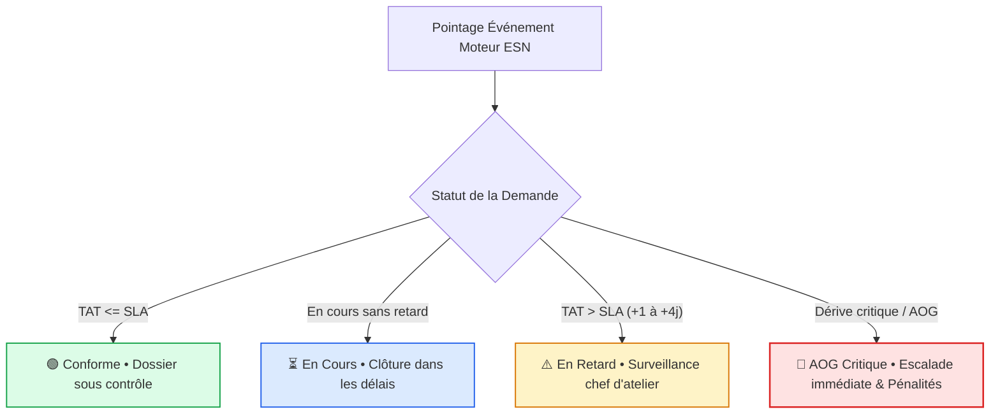

---

## Étape 5 : Capacité

> **Question de cadrage :** Sur quelle base dimensionner et projeter la capacité des ateliers ?  
> **En-tête de l'interface :** Étape 5 : Choisir la méthode d'évaluation de la Capacité Atelier (`⚖️ Modélisation du Capacitaire`)

### Les 4 Méthodes d'Évaluation de la Capacité :
1. **Option 5.A : Prévisions des Demandes (Plan S&OP)**
   - *Principe :* Croisement des déposes annoncées par les compagnies à 3-6 mois et des créneaux de baies réservés.
   - *Formule DAX :* `Charge_Prevue_SOP = SUM(prevision_visit[visites_fermes]) / [capacité_mensuelle]`
2. **Option 5.B : Demandes Effectives à l'Instant (WIP Réel)**
   - *Principe :* Photographie exacte des moteurs et lots physiquement présents sur plancher et pointés en direct.
   - *Formule DAX :* `Taux_Occupation_Live = DIVIDE(COUNTROWS(FILTER(visit, ISBLANK([date_end]))), [capacité_baies])`
3. **Option 5.C : Capacité & Approvisionnement Pièces**
   - *Principe :* Débit d'atelier directement contraint par la disponibilité des kits de rechange (OTIF) et les délais OEM.
   - *Formule DAX :* `Debit_Visite_Pieces = MIN([Capacite_Baies], [Kits_OTIF_Disponibles])`
4. **Option 5.D : Prévisions Multi-factorielles (Réalité MRO)**
   - *Principe :* Simulation probabiliste intégrant rebuts aux contrôles CND/ressuage, créneaux bancs et usure des pièces LLP.
   - *Formule DAX :* `Demande_Predictive_MRO = FORECAST_MRO(cycles_tsn_csn, rebuts_cnd, banc_slots, llp_attrition)`

### Extraits des Vues Capacitaires d'Atelier (Croisement Granularité × Capacité)

#### Extrait A : Visite Macro (visit) × Prévisions S&OP (5.A)
```text
| engine type | mois_cible     | visites_annoncées (S&OP) | créneaux_réservés | couverture_plan         |
| :---------- | :------------- | :----------------------- | :---------------- | :---------------------- |
| CFM56       | M+1 (Octobre)  | 14 visites fermes        | 12 slots          | 116.7 % (Déficit 🚨)    |
| LEAP-1A     | M+1 (Octobre)  | 7 visites fermes         | 8 slots           | 87.5 % (OK)             |
| LEAP-1B     | M+1 (Octobre)  | 5 visites fermes         | 6 slots           | 83.3 % (OK)             |
```
*Formule DAX associée :* `Charge_Prevue_SOP = SUM(prevision_visit[visites_fermes]) / [capacité_mensuelle]`

#### Extrait B : Réparation Méso (repair) × WIP Instantané d'Atelier (5.B)
```text
| shop (atelier) | type of repairs  | lots_repair_wip | durée des transits (en cours) | taux_occupation |
| :------------- | :--------------- | :-------------- | :---------------------------- | :-------------- |
| Montereau      | Aubes Turbine HP | 22 lots actifs  | 3 navettes route              | 91.7 % ⚠️       |
| Villaroche     | Compresseurs     | 11 lots actifs  | 1 navette route               | 68.8 %          |
| Bruxelles      | Banc d'Essai     | 10 lots actifs  | 2 en attente quai             | 100.0 % 🚨      |
```
*Formule DAX associée :* `Occupation_Shop_Live = DIVIDE(COUNTROWS(FILTER(repair, ISBLANK([end]))), [capacité_lots_hebdo])`

#### Extrait C : Tâche Micro (task) × Approvisionnement Pièces au Poste (5.C)
```text
| station [poste]       | composants_requis            | disponibilité_bacs_tampons | manquants_poste         | temps_attente_induit |
| :-------------------- | :--------------------------- | :------------------------- | :---------------------- | :------------------- |
| USI-04 (5-Axes)       | Plaquettes carbure & fraises | 96 %                       | 0 rupture               | 0.0 h                |
| CND-02 (Ressuage)     | Kits éprouvettes ressuage    | 98 %                       | 0 rupture               | 0.0 h                |
| EQU-01 (Équilibrage)  | Masselottes d'équilibrage    | 75 %                       | 3 références en rupture | +6.5 h attente ⚠️    |
```
*Formule DAX associée :* `Attente_Pieces_Poste = SUMX(task, [heures_arret_manquant])`

---

## Étape 6 : Saturation

> **Question de cadrage :** Quels visuels choisir pour repérer les goulots d'étranglement et la surcharge ?  
> **En-tête de l'interface :** Étape 6 : Sélectionner les visuels pour la Saturation des Ateliers (`📊 Dataviz & Conception Graphique`)

### Les 8 Graphiques de Saturation :
- **6.A : Top Pièces Manquantes par Site** (Heures d'attente cumulées et volume des pièces critiques en rupture par centre : Aubes HP, Disques LLP, Joints, Injecteurs).  
  *Usages prépondérants associés :* `Logistique`, `Opérationnel`.
- **6.B : Retards par Réparation & Moteur** (% des demandes avec attente imprévue décliné par famille CFM56 vs LEAP-1A/1B : Usinage carter, Ressuage CND, Aubes HP, Bancs).  
  *Usages prépondérants associés :* `Opérationnel`, `Gouvernance`.
- **6.C : Top Routes de Transfert Inter-Sites** (Part du flux de demandes transférées en sous-traitance et délai navette moyen en jours par axe d'origine).  
  *Usages prépondérants associés :* `Logistique`, `Pilotage`.
- **6.D : Ratio Attente vs Travail Effectif** (Donut Lean isolant le temps de travail à valeur ajoutée de l'attente passive et de la logistique).  
  *Usages prépondérants associés :* `Pilotage`, `Gouvernance`.
- **6.E : Barres de Charge vs Seuil 85%** (Taux d'occupation atelier face à la ligne critique des 85% où la file d'attente explose).  
  *Usages prépondérants associés :* `Opérationnel`, `Pilotage`.
- **6.F : Heatmap Hebdomadaire / Site** (Matrice thermique croisant sites et semaines calendaires pour détecter les pics saisonniers de tension).  
  *Usages prépondérants associés :* `Pilotage`, `Opérationnel`.
- **6.G : Courbes Entrées vs Sorties WIP** (Cumulative Flow Diagram mesurant l'accumulation d'en-cours et la dérive de lead time).  
  *Usages prépondérants associés :* `Logistique`, `Financier`, `Gouvernance`.
- **6.H : Treemap des Goulots d'Atelier** (Cartographie rectangulaire proportionnelle à l'en-cours bloqué par machine ou poste critique).  
  *Usages prépondérants associés :* `Opérationnel`, `Pilotage`, `Logistique`.

### Illustrations Graphiques en Mermaid (Étape 6)

#### 1. Top des Pièces Manquantes Causant l'Attente par Site (Illustration 6.A)


#### 2. Dérive et Retard par Type d'Opération Atelier et Moteur (Illustration 6.B)
```mermaid
%%{init: {'theme': 'base'}}%%
xychart-beta
    title "Part des Demandes Subissant un Aléa Imprévu (% Retard) : CFM56 vs LEAP"
    x-axis ["Usinage Carter Fan", "Ressuage CND", "Revêtement Aubes HP", "Recette Banc d'Essais"]
    y-axis "% Demandes Décalées" 0 --> 35
    bar [18, 14, 12, 8]
    bar [29, 24, 26, 17]
```

#### 3. Top des Routes de Sous-Traitance et Délais Navettes (Illustration 6.C)
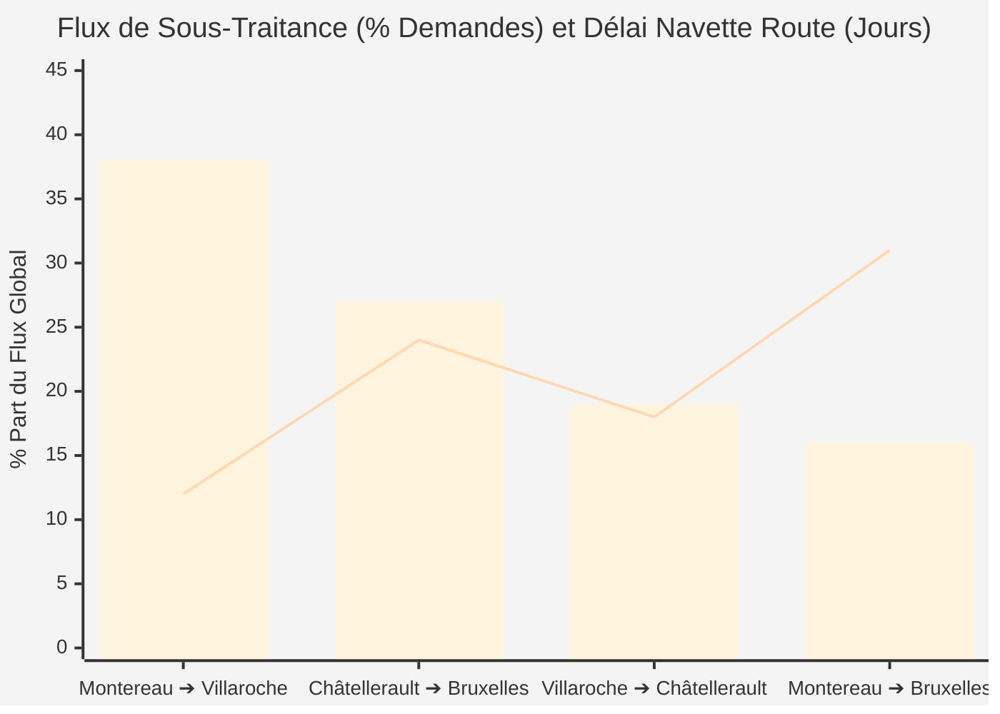

#### 4. Donut Lean : Temps Contact vs Temps d'Attente (Illustration 6.D)
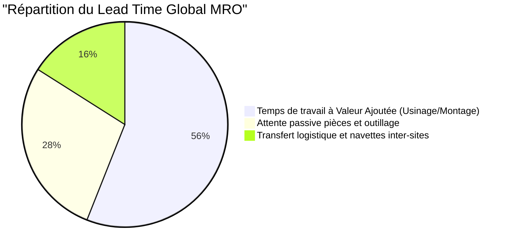

---

## Étape 7 : Synthèse, Profils & Dashboard Dérivé

> **Question de cadrage :** Comment structurer la restitution finale pour engager les parties prenantes ?  
> **En-tête de l'interface :** Étape 7 : Slide de Synthèse Décisionnel & Dashboard Projeté (`✨ Fiche Architecture`)

### Fonctionnalités Clés du Slide Décisionnel :
1. **Dropdowns Interactifs Synchronisés (`#select-q1` à `#select-q6`) :**
   Permettent de modifier instantanément un choix sans devoir reboucler les étapes antérieures.
2. **Barre de Filtres Multidimensionnelle Dynamique :**
   - *Filtre Site :* Tous, Villaroche (VIL), Montereau (MON), Châtellerault (CHL), Bruxelles (BRU).
   - *Filtre Client :* Toutes compagnies, Air France (AFR), Lufthansa (DLH), Delta Air Lines (DAL), Ryanair (RYR).
   - *Filtre Moteur :* CFM56-7B, LEAP-1A, LEAP-1B.
   - *Filtre Date Calendaire Jour :* Sélecteur de date d'entrée prédictive couplé au calcul automatique de la **Date Prévisionnelle de restitution** (`Date + TAT Médian`).
3. **Quatuor de Cartes KPIs Dynamiques :**
   - KPI 1 : Dérive métier selon l'objectif Q1 (ex: AOG critiques, pénalités financières encourues, % SLA).
   - KPI 2 : Suivi opérationnel (dossiers en sursis, livraisons conformes, kits en rupture).
   - KPI 3 : TAT moyen glissant et bornes de dispersion $P_5 - P_{95}$ (selon Q3).
   - KPI 4 : Taux de charge et certitude d'adéquation capacitaire (selon Q5).
4. **Visualisations Temps Réel Croisées :**
   - Cadre gauche : Visualisation du délai calibrée selon l'option choisie en Étape 4 (de 4.A à 4.H).
   - Cadre droit : Visualisation de la saturation calibrée selon l'option choisie en Étape 6 (de 6.A à 6.H).
5. **Recommandations d'Architecture BI & Mesures DAX Déduites :**
   - Formulations automatiques suggérant les colonnes calculées, les liens d'étoile avec le calendrier industriel ouvré et les règles de partitionnement DirectQuery / Import selon la combinaison `[Q1, Q2, Q3, Q4, Q5, Q6]`.
