# MAESTRO - Référentiel des Contenus & Cadrage Métier MRO

Ce document constitue le référentiel textuel, méthodologique et technique synchronisé avec l'application SPA `index.html`. Il rassemble le contexte opérationnel, les enjeux de gouvernance des données, les descriptions fonctionnelles, les représentations graphiques Mermaid ainsi que les extraits des tables dynamiques et formules DAX.

---

## Sommaire
- [Étape 0 : Contexte & Documentation](#étape-0--contexte--documentation)
- [Étape 1 : Question Métier](#étape-1--question-métier)
- [Étape 2 : Modèle de Données](#étape-2--modèle-de-données)
- [Étape 3 : Calcul du Délai (TAT)](#étape-3--calcul-du-délai-tat)
- [Étape 4 : Visuels de Délai (TAT)](#étape-4--visuels-de-délai-tat)
- [Étape 5 : Évaluation de la Capacité](#étape-5--évaluation-de-la-capacité)
- [Étape 6 : Visuels de Saturation](#étape-6--visuels-de-saturation)
- [Étape 7 : Synthèse, Profils & Dashboard Dérivé](#étape-7--synthèse-profils--dashboard-dérivé)
- [Stratégie de Génération de Données & Moteur Pseudo-Aléatoire Seedé](#stratégie-de-génération-de-données--moteur-pseudo-aléatoire-seedé)

---

## Étape 0 : Contexte & Documentation

> **En-tête de l'interface :** Étape 0 : Contexte & Documentation  
> **Comportement :** La page Étape 0 charge et affiche le contenu des fichiers Markdown du dossier racine via un sélecteur en haut (`readme.md` par défaut, puis `content.md`, `gouvernance.md`, `AGENTS.md`, `data.json`). Les fichiers `.json` (`data.json`) sont affichés avec coloration syntaxique.

### 0.1 Contenu par défaut (readme.md)
Le fichier `readme.md`, affiché par défaut, est rédigé dans un langage clair et pédagogique pour les utilisateurs métier sans prérequis technique, avec un fort focus sur l'apprentissage pas à pas, la **Data Gouvernance** (*Data Ownership, Golden Source*) et la **Data Qualité** (*fraîcheur, complétude, auditabilité des calculs et éthique de restitution*). Il guide l'utilisateur à travers le parcours en 7 étapes et lui fournit les 5 réflexes qualité indispensables au quotidien.

> *(La **Méthodologie Data & Gouvernance** détaillée est également consultable à tout moment via le bouton d'information `i` (icône Lucide) présent à côté du titre de chaque étape, ouvrant une modale globale avec ancres de navigation directe.)*

---

## Étape 1 : Question Métier

> **Question de cadrage :** Quel est le premier problème que le tableau de bord doit résoudre ?  
> **En-tête de l'interface :** Étape 1 : Question Métier

### Référentiel des Personas SAE (MAESTRO) :
Le projet MAESTRO s'articule autour des acteurs décisionnels de la maintenance MRO :
- **Engine Owner (EOWN) :** Assure le suivi technique et opérationnel de la flotte moteur et de ses modules (MM, SM). Valide les jalons du processus RTI (Return to Operation), gère les dérives d'atelier et les priorités.
- **Customer Support Program Manager (CSPM) :** Assure la gestion contractuelle de la maintenance en relation directe client. Gère le removal plan client (chargé de PERF vers IBP), crée les demandes d'induction, suit les dates de Shop Visit prévues sous contrat et lève les alertes en cas de dérive. *Objectif :* Garantir le respect des engagements MRO (TAT Wing to Wing) tout en optimisant les coûts.
- **Network Planner (NTPL) :** Pilote la planification de maintenance et l'attribution des créneaux (slots) à court/moyen terme sur l'ensemble des ateliers (12–36 mois). Assure l'adhérence MPS vs S&OP et gère les arbitrages entre moteurs/modules across all shops. *Objectif :* Assurer une vue consolidée charge/capacité réseau, réduire les surcharges et éliminer les slots perdus (lost slots).
- **Shop Floor Planner (SHPL) :** Ordonnance les activités de maintenance au sein d'un atelier spécifique. Coordonne les lignes moteurs et modules, gère les flux de sous-traitance et réajuste le planning face aux aléas quotidiens (pannes, retards, absences). *Objectif :* Maximiser l'utilisation des postes et l'adhérence au plan court terme (MPS Adherence).
- **Fleet Technical Management (FTM) :** Définit et adapte les gammes d'intervention technique et les workscopes de Shop Visit dans Walk. Évalue l'impact des découvertes techniques et des directives de navigabilité sur la durée prévisionnelle. *Objectif :* Fournir des standards techniques réalistes et ajuster les durées de visite selon l'état moteur.
- **Finance & Controlling (FINC) :** Évalue les impacts budgétaires des choix de planification et chiffre le coût des dérives de TAT et des pénalités contractuelles. Assure le suivi du cost tracking (export IBP vers Cost Tracker). *Objectif :* Optimiser la rentabilité des Shop Visits et fiabiliser les prévisions de coûts.
- **Demand Management & S&OP (DMMG) :** Centralise et consolide les prévisions de demande multi-sources (compagnies, loueurs, interne) lors de la Monthly Demand Review. *Objectif :* Établir un plan de demande partagé et réaliste pour dimensionner le réseau industriel.
- **Data Governance & Quality (DGOV) :** Supervise la qualité, la traçabilité et l'auditabilité des données opérationnelles Part-145 et benchmarke les modèles face à la réalité terrain. *Objectif :* Assurer l'intégrité du modèle et la certification des prédictions.

---

### Options Décisionnelles (1.A à 1.F) :

1. **Option 1.A : SLA & Removal Plan (CSPM)**
   - *Personas SAE :* CSPM • FTM, EOWN, NTPL
   - *Sous-titre :* Respect des SLA, dates Shop Visit & removal plan PERF
   - *Description :* Gérer la maintenance des moteurs clients : suivre les dates d'entrée et de sortie d'atelier, respecter les **SLA** et alerter en cas de dérive.
   - *Orientation de restitution :* Jauges de conformité contractuelle, décompte des dossiers livrés dans les temps et suivi du removal plan PERF synchronisé.

2. **Option 1.B : Équilibrage Réseau & Slots (NTPL)**
   - *Personas SAE :* NTPL • DMMG, SHPL, GBO
   - *Sous-titre :* Charge/capacité multi-ateliers, MPS vs S&OP & slotting réseau
   - *Description :* Planifier à **12–36 mois** la charge des ateliers réseau, équilibrer la charge et la capacité (moteurs et modules) et réduire les créneaux inutilisés.
   - *Orientation de restitution :* Comparatif capacitaire inter-sites (VIL, CHL, MON, BRU) et détection des îlots saturés (> 85%).

3. **Option 1.C : Volumes & Coûts SV (FINC)**
   - *Personas SAE :* FINC • CSPM, EOWN, S&OP
   - *Sous-titre :* Pénalités de retard (€), mix moteurs/modules & IBP to Cost Tracker
   - *Description :* Suivre les volumes d'activité et leur impact financier : écarts budget vs réel, pénalités de retard et coûts des révisions.
   - *Orientation de restitution :* Exposition financière cumulée, compteurs d'ESN sous pénalités journalières et impact sur les coûts de Shop Visit.

4. **Option 1.D : Ordonnancement Atelier (SHPL)**
   - *Personas SAE :* SHPL • EOWN, NTPL
   - *Sous-titre :* Aléas quotidiens (pannes, retards), flux MM/SM & MPS Adherence
   - *Description :* Organiser les réparations dans son atelier, équilibrer charge et capacité, et ajuster le planning face aux aléas quotidiens (pannes, retards, absences).
   - *Orientation de restitution :* Vue d'ordonnancement d'atelier avec 2 lignes de flux (moteurs complets et modules), gestion des aléas machines et réaffectation dynamique de slots.

5. **Option 1.E : Demande & Workscopes (DMMG & FTM)**
   - *Personas SAE :* DMMG & FTM • GBO, CSPM, S&OP
   - *Sous-titre :* Demande multi-sources, workscopes Walk & variance début/fin SV
   - *Description :* Consolider les prévisions d'entrées d'atelier (clients, loueurs, flotte interne) et suivre l'évolution du contenu des réparations entre l'entrée et la sortie.
   - *Orientation de restitution :* Courbe de prévision de la demande multi-sources, suivi de la dérive prévu vs réalisé et analyse de la variance des workscopes Walk.

6. **Option 1.F : Qualité des Données & Modèles (DGOV)**
   - *Personas SAE :* DGOV • FTM, NTPL, SHPL, CSPM
   - *Sous-titre :* Complétude de saisie, benchmark des méthodes de calcul & certitude
   - *Description :* Contrôler la qualité des données de maintenance et s'assurer que les **4 méthodes de calcul** donnent des résultats proches de la réalité.
   - *Orientation de restitution :* Histogrammes comparatifs des méthodes de calcul (TAT et Capacité vs effectif réel), jauge de complétude et score de fiabilité statistique.

---

## Étape 2 : Modèle de Données

> **Question de cadrage :** Quelles tables et niveaux de granularité permettent le calcul du Turn Around Time (TAT) et la planification d'atelier ?  
> **En-tête de l'interface :** Étape 2 : Modèle de Données  
> **Bouton d'affichage :** En haut à gauche du panel de droite, le bouton `schema-toggle` bascule entre le rendu visuel Mermaid SVG (`ui`), l'éditeur code Mermaid interactif (`uml`) et le prompt IA de génération ERD (`erd`), rigoureusement synchronisés avec les diagrammes `erDiagram` et définitions ci-dessous.

---

### 1. 🧱 Master Data Types (MDTs) Recommandés

Les fondations du modèle de données reposent sur deux structures maîtres : l'en-tête de demande et les lignes d'interventions associées.

#### 📁 MDT_MAINTENANCE_REQUEST *(Simple MDT — En-tête de Demande Dossier)*
- **Rôle :** Représente l'en-tête de la demande de révision moteur émise par une compagnie aérienne ou un opérateur.
- **🔑 Clé Primaire (PK) :** `ID_DEMANDE` (ex. `D-2026-000123`, `D-2026-000124`)
- **🏷️ Attributs de Gestion :**
  - `DEMANDEUR` : Compagnie cliente donneuse d'ordre (ex. `Air France (AFR)`, `Lufthansa (DLH)`, `Delta Air Lines (DAL)`).
  - `DATE_DEMANDE` : Horodatage / date d'émission de la demande (`Date / Timestamp`, ex. `2026-03-01`).
  - `PROGRAMME_MOTEUR` : Famille technologique de motorisation (ex. `CFM56`, `LEAP`, `GE90`).
  - `ENGINE_TYPE` : Modèle et variante exacte de propulseur (ex. `CFM56-5B`, `CFM56-7B`, `LEAP-1A26`, `LEAP-1B`).
  - `NIVEAU_URGENCE_GLOBAL` : Niveau de criticité opérationnelle (`Enum` : `Haute / AOG`, `Moyenne`, `Basse`).
  - `COMMENTAIRE_GLOBAL` : Remarques d'admission, contraintes ou contexte de dépose (texte libre).

#### 🔧 MDT_INTERVENTION *(Compound ou Simple MDT — Ligne d'Intervention Atelier)*
- **Rôle :** Représente chaque opération ou intervention technique requise sur le moteur en atelier spécialisé.
- **🔑 Clés Composites (PK) :** `ID_DEMANDE` + `ID_INTERVENTION` (ex. `D-2026-000123` + `I-2026-000123-01`, `I-2026-000123-02`)
- **🏷️ Attributs Opérationnels :**
  - `TYPE_REPARATION` : Famille ou type de révision (`Enum` : `T-INSCND`, `T-AUBTUR`, `T-MAJLOU`, `T-BANESS`, `T-EQUROT`, `T-COMHOT`, `T-REVCAR`, `T-FODREP`).
  - `PRECISION_AUTRE` : Précision textuelle documentée si le type est qualifié en `"Autre"`.
  - `SHOP_ASSIGNE` : Atelier industriel pressenti (`Enum` : `S-MON`, `S-VIL`, `S-CHL`, `S-BRU`, `S-SQY`, `S-GEN`, `S-BDX`, `S-TLS`, `S-LGG`, `S-CRE`).
  - `DONNEES_TECHNIQUES` : Référence technique, manuel de révision OEM ou URL du rapport d'inspection / CND.

---

### 2. 🎛️ Planning Levels (Niveaux de Granularité des Calculs)

Le panneau latéral droit de l'Étape 2 propose un sélecteur à 4 vues :
- **Vue Visuelle Schéma Relationnel (`ui` / `svg`) :** Visualisateur dynamique Mermaid ERD directement branché sur le modèle de données avec clés PK/FK et types normalisés.
- **Vue Modèle Mermaid ERD Éditable (`uml`) :** Code source Mermaid ERD éditable en direct avec persistance en local storage, impactant instantanément le rendu visuel, accompagné de boutons de copie et de réinitialisation (`↻`).
- **Vue Prompt IA Diagramme ERD (`erd`) :** Prompt IA structuré prêt à copier pour générer ou adapter un diagramme Mermaid ERD selon des critères normés (PK, FK, UK, types obligatoires `*`, support explicite du type `enum` avec liste de choix séparée par `|` en commentaire, cardinalités à verbe infinitif).
- **Vue Exemple de Données Tabulaire (`data`) :** Tableau dynamique interactif propulsé par **Grid.js** (thème personnalisé BiMaestro compact) montrant les enregistrements de la table principale (au centre de l'étoile) et des tables dimensionnelles / de faits associées :
  - **Tri par colonne :** Tri ascendant / descendant natif Grid.js au clic sur l'en-tête de colonne avec indicateurs fléchés.
  - **Pagination intégrée :** Affichage strict de 15 lignes par page avec pagination numérique et résumé (`[Préc.] [1] [2]... [Suiv.]`).
  - **Redimensionnement des colonnes :** Support du redimensionnement interactif Grid.js (`resizable: true`).
  - **Jointures & Drill-down :**
    - Pour les relations $N-1$ : affichage d'une colonne unique portant la valeur du premier champ contenant `NOM` ou le libellé du premier champ non PK/FK de la table liée (les autres colonnes de la table liée ne sont pas affichées pour alléger la vue).
    - Pour les relations $1-N$ : affichage d'un badge cliquable indiquant le nombre d'enregistrements liés (ex. `X interventions ↗`) ouvrant la vue filtrée de la table enfant avec fil d'Ariane de retour (`← Table principale`).
  - **Générateur de Données Déduit Dynamiquement (✏️) :** Modale de paramétrage avec sélection de la table et ajustement des règles de génération :
    - *Nombres :* min, max, moyenne (valeur par défaut issue de l'UML $\pm 50\%$).
    - *Dates :* intervalle de date début / fin avec tirage aléatoire uniforme.
    - *Booléens & Enums :* distribution en pourcentages éditables (somme à 100%).
    - *Regex / Codes :* incrémentation automatique des chiffres après le dernier tiret `-` (ex. `D-2026-000123`).
    - *Actions :* Restaurer (règles UML), Regénérer la table active, Regénérer tout le jeu de données, réglage du nombre de lignes.
- **Bouton `+ Créer un tableau` :** Présent dans l'en-tête de l'Étape 2, ouvre une modale permettant d'ajouter des schémas de données personnalisés (Titre, Description, code Mermaid ERD, prompt IA pour générer le diagramme), persistés en `localStorage` et intégrés dynamiquement dans la liste des options d'Étape 2.

Le modèle propose deux perspectives décisionnelles complémentaires selon le niveau de détail souhaité :

#### 📈 Option 2.A : Macro — Consolidation Demande (Granularité Dossier)
- **Granularité :** 1 ligne = 1 demande de révision moteur consolidée.
- **👥 Personas Cibles :** `CSPM`, `EOWN`, `FINC`, `DMMG`, `DGOV`.
- **🧩 Dimensions Clés :** `ID_DEMANDE` + `ENGINE_TYPE` + `DEMANDEUR` + `TIMEPROFILE` (Semaine ou Mois).
- **📊 Usage SAP IBP & Métier :**
  - Consolidation du délai total moteur (**Total Engine TAT Dossier**).
  - Suivi d'avancement global du dossier vis-à-vis des engagements contractuels SLA.
  - Arbitrage macro-capacitaire S&OP et communication client.
- **Hypothèses de simplification :**
  - Forfaitisation des transits logistiques au niveau de la visite.
  - Masquage du cheminement séquentiel interne entre îlots.
  - Allotissement global des approvisionnements dès l'induction.

##### 📋 Dictionnaire de Données — Option 2.A (Consolidation Demande)

| Table & Champ | Type / Format | Cardinalité | Rôle & Description | Exemple Concret |
| :--- | :--- | :--- | :--- | :--- |
| **`MDT_MAINTENANCE_REQUEST`** | | **Fait / MDT Central** | **1 ligne = 1 demande globale de maintenance moteur** | `D-2026-000123` |
| ↳ `ID_DEMANDE` | `String` (`D-YYYY-XXXXXX`)| **PK** (1:1) | Identifiant unique de la demande | `"D-2026-000123"` |
| ↳ `DEMANDEUR` | `String` (Code/Nom Client)| Attribut client | Compagnie aérienne propriétaire ou opératrice | `"Air France (AFR)"` |
| ↳ `DATE_DEMANDE` | `Date` (`YYYY-MM-DD`) | Attribut temporel | Date d'émission de la demande d'intervention | `"2026-03-01"` |
| ↳ `PROGRAMME_MOTEUR` | `String` (`Enum`) | Famille moteur | Famille technologique globale de motorisation | `"LEAP"` / `"CFM56"` |
| ↳ `ENGINE_TYPE` | `String` (Modèle exact) | Clé technique | Variante précise de moteur d'aéronef | `"LEAP-1A26"` |
| ↳ `NIVEAU_URGENCE_GLOBAL` | `String` (`Enum`) | Priorité dossier | Urgence opérationnelle (`Haute / AOG`, `Moyenne`, `Basse`) | `"Haute (AOG)"` |
| ↳ `COMMENTAIRE_GLOBAL` | `String` (Texte libre) | Contexte dossier | Observations techniques de dépose et antécédents | `"Dépose sous aile suite FOD"` |
| ↳ `INTERVENTION_COUNT` | `Integer` | **Key Figure** agrégée | Nombre d'interventions actives rattachées au dossier | `3` interventions |
| ↳ `URGENCY_WEIGHT` | `Float` (Poids numérique) | **Key Figure** algo | Poids calculé pour prioriser l'allocation d'atelier | `3.0` (Priorité max) |
| ↳ `TOTAL_ENGINE_TAT` | `Float` (Jours) | **Key Figure** consolidée| TAT consolidé du moteur (somme série / max parallèle) | `21.5` jours |

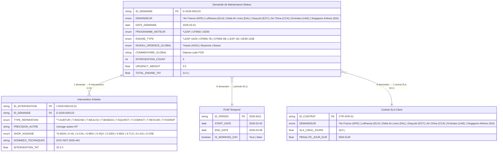

---

#### 🎯 Option 2.B : Atelier — Lignes d'Intervention (Granularité Fine)
- **Granularité :** 1 ligne = 1 intervention unitaire sur une **station de réparation** (`STATION_ASSIGNEE`) située dans un **shop** (`SHOP_ASSIGNE`).
- **👥 Personas Cibles :** `SHPL`, `FTM`, `NTPL`, `EOWN`, `DGOV`.
- **🧩 Dimensions Clés :** `ID_DEMANDE` + `ID_INTERVENTION` + `STATION_ASSIGNEE` (`S-XXX-YY`) + `SHOP_ASSIGNE` (`S-XXX`) + `TIMEPROFILE` (Semaine ou Jour).
- **📊 Usage SAP IBP & Métier :**
  - Stockage des dates réelles de démarrage, d'attente et de clôture de chaque opération unitaire.
  - Ordonnancement fin par station (`S-XXX-YY`) et équilibrage de charge au sein de chaque shop (`S-XXX`).
  - Suivi des files d'attente (`Shop Queue Time`) et des gammes standards constructeur (`Estimated Repair Duration`).

##### 📋 Dictionnaire de Données — Option 2.B (Interventions, Stations & Ateliers)

| Table & Champ | Type / Format | Cardinalité | Rôle & Description | Exemple Concret |
| :--- | :--- | :--- | :--- | :--- |
| **`MDT_INTERVENTION`** | | **Fait / MDT Central** | **1 ligne = 1 intervention unitaire sur station & shop** | `I-2026-000123-01` |
| ↳ `ID_DEMANDE` | `String` (`D-YYYY-XXXXXX`)| **PK composite** (1/2)| Référence à l'en-tête de demande parente | `"D-2026-000123"` |
| ↳ `ID_INTERVENTION` | `String` (`I-YYYY-XXXXXX-ZZ`)| **PK composite** (2/2)| Numéro d'opération unitaire dans le dossier | `"I-2026-000123-01"` |
| ↳ `TYPE_REPARATION` | `String` (`Enum`) | Type de réparation | Gamme technique parmi les 8 types (`T-XXXXXX`) | `"T-AUBTUR"` |
| ↳ `PRECISION_AUTRE` | `String` | Précision technique | Détail obligatoire si `TYPE_REPARATION` = "Autre" | `""` (ou `"Re-frettage spécifique"`) |
| ↳ `STATION_ASSIGNEE` | `String` (`Enum`) | **FK vers STATION** | Station de réparation assignée (`S-XXX-YY`, 3-10 par shop) | `"S-MON-01"` |
| ↳ `SHOP_ASSIGNE` | `String` (`Enum`) | **FK vers SHOP** | Shop industriel de rattachement (`S-XXX`, 10 sites) | `"S-MON"` |
| ↳ `DONNEES_TECHNIQUES`| `String` (Lien / Réf) | Spécification Part-145| Référence ou URL du rapport d'inspection / procédure OEM | `"DOC-NDT-2026-442"` |
| ↳ `ESTIMATED_REPAIR_DURATION` | `Float` (Heures) | **Key Figure** théorique| Durée standard de gamme estimée selon le type de réparation | `18.5` heures |
| ↳ `SHOP_QUEUE_TIME` | `Float` (Heures) | **Key Figure** dynamique| Temps d'attente file calculé selon la charge station et shop | `12.0` heures |
| ↳ `INTERVENTION_TAT` | `Float` (Heures) | **Key Figure** totale | Somme attente + durée traitement + transits éventuels | `32.5` heures |
| **`STATION`** | | **Dimension Postes** | **3 à 10 stations de réparation par shop (`S-XXX-YY`)** | `S-MON-01` |
| ↳ `ID_STATION` | `String` (`S-XXX-YY`) | **PK unique** | Identifiant de la station (`XXX` = shop, `YY` = numéro station) | `"S-MON-01"` |
| ↳ `SHOP_ASSIGNE` | `String` (`S-XXX`) | **FK vers SHOP** | Shop parent hébergeant la station | `"S-MON"` |
| ↳ `NOM_STATION` | `String` | Libellé équipement | Nom de la baie, banc ou machine de la station | `"Usinage Aubes HP Tour CN"` |
| ↳ `TYPE_REPARATION` | `String` (`Enum`) | Spécialité | Type d'intervention opéré sur la station | `"T-AUBTUR"` |
| ↳ `SEUIL_SATURATION` | `Float` (%) | Paramètre critique | Seuil d'alerte de saturation capacitaire | `85.0` % |
| **`SHOP`** | | **Dimension Sites** | **10 ateliers industriels SAE (`S-XXX`)** | `S-MON` |
| ↳ `SHOP_ASSIGNE` | `String` (`S-XXX`) | **PK unique** | Code trigramme du shop | `"S-MON"` |
| ↳ `NOM_ATELIER` | `String` | Libellé site | Implantation géographique du centre MRO | `"Montereau"` |
| ↳ `NB_STATIONS` | `Integer` | Nombre de postes | Volume de stations hébergées (3 à 10 stations) | `6` |
| ↳ `CAPACITE_HEBDO` | `Float` (Heures) | Capacité nominale | Heures d'ouverture réseau disponibles par semaine | `1450.0` heures |

##### ⚙️ Matrice Métier : 10 Shops, 3 à 10 Stations par Shop & 8 Types de Réparation
- **Règles architecturales du réseau SAE :**
  - Une intervention a lieu sur une **station de réparation** (`S-XXX-YY`) qui se trouve dans un **shop** (`S-XXX`).
  - Chaque shop gère entre **3 et 10 stations** de réparation et entre **2 et 4 types de réparation**.
  - Il existe exactement **8 types de réparation** (`T-XXXXXX`) et chaque type concerne **2 à 3 modèles de moteur** (sur les 6 flottes).

| Shop SAE | Nom / Implantation | Nb Stations | Nomenclature Stations (S-XXX-YY) | Types de Réparation Gérés |
| :--- | :--- | :---: | :--- | :--- |
| `S-VIL` | Villaroche | 8 | `S-VIL-01` à `S-VIL-08` | `T-EQUROT`, `T-COMHOT`, `T-INSCND`, `T-MAJLOU` |
| `S-MON` | Montereau | 6 | `S-MON-01` à `S-MON-06` | `T-AUBTUR`, `T-COMHOT`, `T-FODREP` |
| `S-CHL` | Châtellerault | 5 | `S-CHL-01` à `S-CHL-05` | `T-MAJLOU`, `T-REVCAR`, `T-INSCND` |
| `S-BRU` | Bruxelles | 6 | `S-BRU-01` à `S-BRU-06` | `T-INSCND`, `T-BANESS`, `T-FODREP` |
| `S-TLS` | Toulouse | 5 | `S-TLS-01` à `S-TLS-05` | `T-MAJLOU`, `T-BANESS`, `T-EQUROT` |
| `S-SQY` | Saint-Quentin | 4 | `S-SQY-01` à `S-SQY-04` | `T-EQUROT`, `T-REVCAR` |
| `S-GEN` | Gennevilliers | 4 | `S-GEN-01` à `S-GEN-04` | `T-AUBTUR`, `T-REVCAR` |
| `S-BDX` | Bordeaux | 3 | `S-BDX-01` à `S-BDX-03` | `T-FODREP`, `T-MAJLOU` |
| `S-LGG` | Liège | 4 | `S-LGG-01` à `S-LGG-04` | `T-BANESS`, `T-INSCND` |
| `S-CRE` | Le Creusot | 3 | `S-CRE-01` à `S-CRE-03` | `T-AUBTUR`, `T-COMHOT` |

```mermaid
erDiagram
    MDT_MAINTENANCE_REQUEST ||--o{ MDT_INTERVENTION : "1 demande → N interventions (1:N)"
    SHOP ||--o{ STATION : "1 shop → 3 à 10 stations (1:N)"
    STATION ||--o{ MDT_INTERVENTION : "1 station → N interventions (1:N)"
    SHOP ||--o{ MDT_INTERVENTION : "1 shop → N interventions (1:N)"
    TIMEPROFILE ||--o{ MDT_INTERVENTION : "1 période → N interventions (1:N)"
    DUREE_STANDARDS ||--o{ MDT_INTERVENTION : "1 standard → N interventions (1:N)"

    MDT_INTERVENTION ["Intervention d'Atelier"] {
        string ID_DEMANDE PK "D-2026-000123"
        string ID_INTERVENTION PK "I-2026-000123-01"
        enum TYPE_REPARATION "*T-AUBTUR | T-INSCND | T-MAJLOU | T-BANESS | T-EQUROT | T-COMHOT | T-REVCAR | T-FODREP"
        string PRECISION_AUTRE "Re-frettage specifique"
        enum STATION_ASSIGNEE FK "*S-MON-01 | S-MON-02 | S-MON-03 | S-VIL-01 | S-VIL-02 | S-CHL-01 | S-TLS-01"
        enum SHOP_ASSIGNE FK "*S-MON | S-VIL | S-CHL | S-BRU | S-SQY | S-GEN | S-BDX | S-TLS | S-LGG | S-CRE"
        string DONNEES_TECHNIQUES "DOC-NDT-2026-442"
        float ESTIMATED_REPAIR_DURATION "18.5 h"
        float SHOP_QUEUE_TIME "12.0 h"
        float INTERVENTION_TAT "32.5 h"
    }
    STATION ["Station de Réparation"] {
        string ID_STATION PK "S-MON-01"
        enum SHOP_ASSIGNE FK "*S-MON | S-VIL | S-CHL | S-BRU | S-SQY | S-GEN | S-BDX | S-TLS | S-LGG | S-CRE"
        string NOM_STATION "Usinage Aubes HP Tour CN"
        enum TYPE_REPARATION "*T-AUBTUR | T-INSCND | T-MAJLOU | T-BANESS | T-EQUROT | T-COMHOT | T-REVCAR | T-FODREP"
        float SEUIL_SATURATION "85.0 %"
    }
    SHOP ["Atelier (Shop)"] {
        enum SHOP_ASSIGNE PK "*S-MON | S-VIL | S-CHL | S-BRU | S-SQY | S-GEN | S-BDX | S-TLS | S-LGG | S-CRE"
        string NOM_ATELIER "Montereau"
        int NB_STATIONS "6"
        float CAPACITE_HEBDO "1450.0 h"
    }
    MDT_MAINTENANCE_REQUEST ["Demande de Maintenance Moteur"] {
        string ID_DEMANDE PK "D-2026-000123"
        enum DEMANDEUR "*Air France (AFR) | Lufthansa (DLH) | Delta Air Lines (DAL) | EasyJet (EZY) | Air China (CCA) | Emirates (UAE) | Singapore Airlines (SIA)"
        enum ENGINE_TYPE "*LEAP-1A26 | CFM56-7B | CFM56-5B | LEAP-1B | GE90-115B"
        enum NIVEAU_URGENCE_GLOBAL "*Haute (AOG) | Moyenne | Basse"
    }
    DUREE_STANDARDS ["Durées Standards"] {
        enum ENGINE_TYPE PK "*LEAP-1A26 | CFM56-7B | CFM56-5B | LEAP-1B | GE90-115B"
        enum TYPE_REPARATION PK "*T-AUBTUR | T-INSCND | T-MAJLOU | T-BANESS | T-EQUROT | T-COMHOT | T-REVCAR | T-FODREP"
        float DUREE_STANDARD_H "18.5 h"
    }
    TIMEPROFILE ["Profil Temporel"] {
        string ID_PERIOD PK "2026-W10"
        date DATE_DEBUT "2026-03-02"
        date DATE_FIN "2026-03-08"
    }
```

---

### 3. 📊 Key Figures (Indicateurs Clés Associés)

Le modèle relie les MDTs et les Planning Levels aux Key Figures de calcul suivantes :

#### 📥 Indicateurs d'Ordre & État (Pilotage Dossier) :
1. **`Intervention Count`** :
   - *Définition :* Nombre d'interventions actives rattachées au dossier de visite.
   - *Formule :* `COUNT(ID_INTERVENTION)` groupé par `ID_DEMANDE`.
   - *Usage :* Dimensionnement de la complexité du chantier moteur et suivi de complétude.
2. **`Urgency Weight`** :
   - *Définition :* Poids numérique associé au `NIVEAU_URGENCE_GLOBAL` pour prioriser le séquencement dans l'algorithme d'allocation capacitaire.
   - *Barème standard :* `Haute / AOG = 3.0`, `Moyenne = 2.0`, `Basse = 1.0`.
   - *Usage :* Tri prioritaire des files d'attente machines et réservation prioritaire de baies.

#### ⏱️ Indicateurs de Temps & Charge par Atelier :
1. **`Estimated Repair Duration`** :
   - *Définition :* Durée standard théorique estimée pour le `TYPE_REPARATION` et l'`ENGINE_TYPE` retenus.
   - *Source :* Barème méthode constructeur issu de la table de référence dimensionnelle.
2. **`Shop Queue Time`** :
   - *Définition :* Temps d'attente estimé dans le `SHOP_ASSIGNE`, calculé en fonction de la charge instantanée et de l'engorgement de l'atelier face au seuil critique (85%).
   - *Formule :* `Shop_Queue_Time = f(Taux_Occupation_Shop, Seuil_Saturation)`.
3. **`Intervention TAT`** :
   - *Définition :* Turn Around Time unitaire de l'opération d'atelier.
   - *Formule :* `Intervention_TAT = Shop_Queue_Time + Estimated_Repair_Duration + Delai_Transit_Eventuel`.
4. **`Total Engine TAT (Dossier)`** :
   - *Définition :* Délai global consolidé de la visite moteur pour le client.
   - *Formule :* $\max(\text{Intervention\_TAT})$ pour les opérations menées en parallèle, ou $\sum(\text{Intervention\_TAT})$ pour les opérations menées sur le chemin critique en série.

---

---

## Étape 3 : Calcul du Délai (TAT)

> **Question de cadrage :** Quel niveau de complexité mathématique et d'hypothèse adopter ?  
> **En-tête de l'interface :** Étape 3 : Calcul du Délai (TAT)

> **Rendu Tableau & Modes de Vue (Étape 3) :** Le panneau latéral droit dispose d'un sélecteur à 4 modes :
> - **`data` :** Vue tableau interactive propulsée par Grid.js (tri multi-colonnes, pagination 15/15 avec résumé, redimensionnement) et bouton d'édition des mesures `✎` (`#mesure-generator-modal`, interface unifiée avec le générateur de données, support de tous les types de champs, mode distribution ou formule compact avec autocomplétion des opérateurs et champs, tooltip d'aide Excel-like et validation syntaxique instantanée).
> - **`uml` :** Modèle relationnel UML ciblé affichant uniquement les tables et champs intervenant dans le calcul du TAT, avec commandes de zoom/pan (+, −, ↺) et mode éditeur en cas de mesure personnalisée (`+ Mesure`).
> - **`chartjs` :** Prompt IA standardisé et personnalisable (bouton template `✎` visible sur ce mode, copie `⧉`) pour proposer une visualisation pertinente basée sur les entrées dans un code bloc au format contenu sans le { } de l'objet js de ChartJS.
> - **`visuels` :** Prompt IA structuré formulant 3 idées de visuels compatibles SAP-IBP / SAC.

### Les 4 Méthodes de Calcul du TAT :
1. **Option 3.A : S&OP (D-SOP)**
   - *Description :* Délais contractuels et standards constructeur basés sur les gammes opératoires et les forfaits d'acheminement.
   - *Principe :* Barème fixe additionnant le temps de révision nominal et les transits logistiques (`ESTIMATED_REPAIR_DURATION` + `TRANSIT_BUFFER`).
   - *Usage MRO :* Devis d'engagement initial Part-145 et planification macro à moyen terme.
   - *Formule DAX :* `SUMX(MDT_INTERVENTION, [ESTIMATED_REPAIR_DURATION] + [TRANSIT_BUFFER])`
2. **Option 3.B : Projection statistique (D-STA)**
   - *Description :* Historique réel des visites et dispersion constatée (P5, P50, P95) pour sécuriser les engagements clients.
   - *Principe :* Distribution empirique réelle issue des passages réels pour mesurer les aléas de visite ($P_5, P_{50}, P_{95}$).
   - *Usage MRO :* Négociation des fenêtres de vol garanties (SLA) et maîtrise du risque de pénalité.
   - *Formule DAX :* `PERCENTILEX.INC(FAIT, FAIT[Duree_Reelle], 0.50)`
3. **Option 3.C : Projection capacitaire (D-CAP)**
   - *Description :* Délais réels ajustés selon le niveau de charge et l'encombrement des ateliers.
   - *Principe :* Allongement dynamique des délais d'attente à mesure que l'atelier sature (> 85%).
   - *Usage MRO :* Alerte précoce sur les goulets d'étranglement et réorientation préventive des moteurs.
   - *Formule DAX :* `DIVIDE(Temps_Usinage, 1 - RELATED(DIM_SITE[Taux_Charge]))`
4. **Option 3.D : Modélisation avancée (D-ML)**
   - *Description :* Prévision dynamique combinant l'usure prédictive des pièces et les aléas techniques de visite.
   - *Principe :* Simulation multi-paramètres intégrant l'historique moteur, les contrôles et les rebuts.
   - *Usage MRO :* Pilotage prédictif fin de l'ordonnancement et optimisation continue des créneaux.
   - *Formule DAX :* `SIMULATE_TAT_ADVANCED(FAIT, CONTEXT)`

### Extraits des Tables Dynamiques d'Atelier (Croisement Granularité × TAT)

#### Extrait A : Consolidation Demande (MDT_MAINTENANCE_REQUEST) × Projection Statistique (3.B D-STA)
```text
| ID_DEMANDE     | DEMANDEUR       | ENGINE_TYPE | P05_OPT | P50_MEDIAN | P95_PESS | TOTAL_ENGINE_TAT |
| :------------- | :-------------- | :---------- | :------ | :--------- | :------- | :--------------- |
| D-2026-000123  | Air France      | LEAP-1A26   | 15.0 j  | 21.5 j     | 32.0 j   | 21.5 j           |
| D-2026-000124  | Lufthansa       | CFM56-5B    | 11.5 j  | 16.0 j     | 23.5 j   | 16.0 j           |
| D-2026-000125  | Delta Air Lines | CFM56-7B    | 18.0 j  | 24.5 j     | 36.0 j   | 24.5 j           |
```
*Formule DAX associée :* `Total_Engine_TAT_Median = PERCENTILEX.INC(MDT_MAINTENANCE_REQUEST, [TOTAL_ENGINE_TAT], 0.50)`

#### Extrait B : Lignes d'Intervention (MDT_INTERVENTION) × S&OP (3.A D-SOP)
```text
| ID_DEMANDE     | ID_INTERVENTION  | TYPE_REPARATION | SHOP_ASSIGNE | ESTIMATED_REPAIR_DURATION | SHOP_QUEUE_TIME | INTERVENTION_TAT |
| :------------- | :--------------- | :-------------- | :----------- | :------------------------ | :-------------- | :--------------- |
| D-2026-000123  | I-2026-000123-01 | T-INSCND        | S-MON        | 18.5 h                    | + 12.0 h        | 30.5 h           |
| D-2026-000123  | I-2026-000123-02 | T-AUBTUR        | S-MON        | 28.0 h                    | + 8.5 h         | 36.5 h           |
| D-2026-000123  | I-2026-000123-03 | T-EQUROT        | S-VIL        | 14.0 h                    | + 4.0 h         | 18.0 h           |
```
*Formule DAX associée :* `Intervention_TAT = SUMX(MDT_INTERVENTION, [ESTIMATED_REPAIR_DURATION] + [SHOP_QUEUE_TIME])`

---

## Étape 4 : Délai

> **Question de cadrage :** Quels visuels utiliser pour piloter les délais des demandes de maintenance (MDT_MAINTENANCE_REQUEST) et les engagements clients ?  
> **En-tête de l'interface :** Étape 4 : Sélectionner les visuels pour le Délai (TAT)  
> **Rendu Chart.js & Modes de Vue (Étape 4) :** Les cartes d'options disposent d'un panneau à droite piloté par un sélecteur à 5 modes :
> - **`ui` :** Vue graphique Chart.js interactive avec infobulles et étiquettes de données (`chartjs-plugin-datalabels`).
> - **`config` :** Configuration JSON Chart.js éditable en temps réel avec répercussion instantanée sur le rendu graphique `ui` et persistance automatique.
> - **`chartjs` :** Prompt IA permettant de générer une configuration Chart.js à partir des entrées calculées et des schémas ERD.
> - **`visuels` :** Prompt IA structuré formulant 3 idées de visuels compatibles SAP-IBP / SAC.
> - **`sap` :** Descriptif structuré technique et autoporteur en Markdown aligné sur l'interface et les possibilités natives de SAP-IBP et SAC (titre, composant SAC, modèle MDT IBP, axes X/Y, dimensions, mesures et Key Figures, règles et seuils d'alerte) avec bouton de copie rapide pour injection directe dans un prompt IA.

### Les 9 Graphiques Disponibles pour le Délai :
- **4.A : TAT Médian & Bornes (P5-P95)**  
  *Description métier :* Délai médian d'immobilisation par moteur et variabilité constatée (meilleur cas P5 vs cas défavorable P95).  
  *Personas cibles :* FTM & NTPL.  
  *Analytics SAC / IBP :* Boxplot / Barres de Dispersion (Percentiles P5-P50-P95) | Axes : X = `ENGINE_TYPE` (CFM56-7B, LEAP-1A, LEAP-1B) • Y = `TOTAL_ENGINE_TAT` (jours) | Mesures : `P50_MEDIAN_TAT`, `P5_LOWER_TAT`, `P95_UPPER_TAT`.  
  *Rendu :* Distribution statistique avec étiquettes de valeurs par défaut sur les médianes et bornes.  
  *Badges personas & usages :* `NTPL`, `DMMG`, `FTM`, `DGOV`.
- **4.B : Décomposition du TAT**  
  *Description métier :* Répartition du temps total de visite par moteur : réparation en atelier, attente logistique/client et transit.  
  *Personas cibles :* CSPM & DMMG.  
  *Analytics SAC / IBP :* Stacked Bar Chart / Barres Empilées Horizontales | Axes : X = `ENGINE_TYPE` (CFM56-7B, CFM56-5B, LEAP-1A, LEAP-1B, GE90-115B) • Y = Mesures Cumulées (jours) | Mesures : `TEMPS_REVISION_ATELIER`, `ATTENTE_VALIDATION_APPRO`, `TRANSIT_LOGISTIQUE`.  
  *Rendu :* Barres empilées décomposant le TAT global de la visite (Atelier, Attente appro/client, Transit) avec affichage systématique des valeurs en jours.  
  *Badges personas & usages :* `CSPM`, `DMMG`, `EOWN`.
- **4.C : Respect des Délais Clients**  
  *Description métier :* Comparaison du délai réel face à l'engagement contractuel (SLA) par compagnie aérienne et taux de retard associé.  
  *Personas cibles :* CSPM & FINC.  
  *Analytics SAC / IBP :* Dual-Axis Combination Chart / Barres Groupées & Ligne % | Axes : X = `DEMANDEUR` (Air France, Lufthansa, Delta Air Lines, Ryanair), `ENGINE_TYPE` • Y1 = `TOTAL_ENGINE_TAT` (jours) • Y2 = `SLA_NON_RESPECT_PCT` (%) | Mesures : `SLA_CIBLE_JOURS`, `TOTAL_ENGINE_TAT`, `SLA_NON_RESPECT_PCT`.  
  *Rendu :* Barres groupées et courbe combinée avec étiquettes de valeurs actives en permanence.  
  *Badges personas & usages :* `CSPM`, `FTM`, `FINC`.
- **4.D : Tableau d'Alertes des Demandes**  
  *Description métier :* Suivi opérationnel des dossiers moteurs en cours avec code couleur d'urgence, jours de dérive et risque financier.  
  *Personas cibles :* EOWN & CSPM.  
  *Analytics SAC / IBP :* Table Matrice SAC avec Seuils Conditionnels | Axes : Lignes = `MDT_MAINTENANCE_REQUEST` (`ID_DEMANDE`) • Colonnes = Attributs & Mesures | Dimensions : `ID_DEMANDE` (D-2026-XXXXXX), `DEMANDEUR`, `ENGINE_TYPE`, `NIVEAU_URGENCE_GLOBAL` | Mesures : `TOTAL_ENGINE_TAT`, `TAT_DELAY_DAYS`, `PENALITE_JOUR_EUR`, `TOTAL_PENALTIES`.  
  *Rendu :* Répartition catégorisée (Conforme, En cours, Retard, AOG critique) avec badges et pénalités de retard.  
  *Badges personas & usages :* `EOWN`, `CSPM`, `SHPL`.
- **4.E : Cartes KPIs**  
  *Description métier :* Indicateurs clés synthétiques : délai moyen glissant, respect contractuel global et volume de moteurs immobilisés.  
  *Personas cibles :* CSPM & Direction MRO.  
  *Analytics SAC / IBP :* Numeric Multi-KPI Tile (Cartes Métriques SAC) | Axes : N/A (Indicateurs scalaires agrégés) | Dimensions : `PROGRAMME_MOTEUR`, `TIMEPROFILE` | Mesures : `AVG_TOTAL_ENGINE_TAT`, `SLA_COMPLIANCE_RATE`, `CRITICAL_WIP_DEVIATION`.  
  *Rendu :* Cartes métriques scalaires et indicateurs de volume global des demandes avec affichage direct des valeurs.  
  *Badges personas & usages :* `CSPM`, `NTPL`, `FTM`.
- **4.F : Barres vs Seuils Cibles P85**  
  *Description métier :* Délai effectif par type de moteur positionné face au seuil contractuel d'engagement (P85).  
  *Personas cibles :* FTM & CSPM.  
  *Analytics SAC / IBP :* Horizontal Bar Chart avec Reference Line (Seuil Cible P85) | Axes : X = `TOTAL_ENGINE_TAT` (jours) • Y = `ENGINE_TYPE` (CFM56-7B, CFM56-5B, LEAP-1A, LEAP-1B, GE90-115B) | Mesures : `ACTUAL_TOTAL_TAT`, `P85_CONTRACTUAL_THRESHOLD`.  
  *Rendu :* Barres horizontales avec seuils cibles SLA P85 par motorisation et valeurs exactes en bout de barre.  
  *Badges personas & usages :* `FTM`, `CSPM`, `DMMG`.
- **4.G : Waterfall des Dérives**  
  *Description métier :* Cascade analytique expliquant l'écart entre le délai promis et le délai réel (attente pièces, aléas contrôle, etc.).  
  *Personas cibles :* FINC & CSPM.  
  *Analytics SAC / IBP :* Waterfall / Cascade Chart (Bridge Analysis SAC) | Axes : X = `CAUSE_DERIVE` (SLA_CIBLE, WAITING_PARTS, UNPLANNED_CND, FAST_TRACK, TAT_REEL) • Y = `CUMULATIVE_ENGINE_TAT` (Variance Cumulée en jours) | Mesures : `TAT_VARIANCE_DAYS`, `CUMULATIVE_ENGINE_TAT`.  
  *Rendu :* Cascade de barres flottantes avec delta chiffré sur chaque composante de retard au dossier.  
  *Badges personas & usages :* `FINC`, `CSPM`, `DMMG`.
- **4.H : Heatmap Occupation Réseau (S34-S42)**  
  *Description métier :* Vue matricielle de la charge des 10 ateliers MRO par semaine calendaire avec seuils de tension visuels.  
  *Personas cibles :* NTPL & Direction Industrielle.  
  *Analytics SAC / IBP :* Heatmap Matrix SAC (Tension Capacitaire Multi-Sites) | Axes : X = Semaines Calendaires (S34 à S42) • Y = Centres SAE MRO (10 sites réseau) | Dimensions : `SITE_MRO` (10 centres SAE), `SEMAINE_CALENDAIRE` (S34 à S42) | Mesures : `TAUX_OCCUPATION_PCT` (%), `SEUIL_VIGILANCE` (80%), `SEUIL_CRITIQUE` (95%).  
  *Rendu :* Matrice thermique croisant les 10 centres MRO SAE en Y et les 9 semaines S34 à S42 en X avec échelle trichromatique de charge (Vert < 80%, Jaune 80-95%, Rouge > 95%).  
  *Badges personas & usages :* `NTPL`, `Direction Industrielle`, `FTM`.
- **4.I : Comparatif 4 Méthodes vs Réel**  
  *Description métier :* Comparaison du délai simulé par les 4 méthodes de calcul face au délai réel constaté de 18.2 jours.  
  *Personas cibles :* DGOV & FTM.  
  *Analytics SAC / IBP :* Dual-Axis Clustered Bar & Deviation Line Chart | Axes : X = `METHODE_CALCUL` (D-SOP, D-STA, D-CAP, D-ML) • Y1 = `TAT_ESTIME_JOURS` • Y2 = `%_VARIANCE_VS_EFFECTIF` | Dimensions : `METHODE_CALCUL_TAT` (D-SOP, D-STA, D-CAP, D-ML), `STATUT_CERTITUDE` | Mesures : `TAT_CALCULE_JOURS`, `TAT_EFFECTIF_REF` (18.2 j), `ECART_RELATIF_PCT`, `DATA_COMPLETENESS_RATE` (93.4%).  
  *Rendu :* Histogramme à barres comparant le TAT calculé de chaque méthode face au TAT effectif de référence, avec ligne de % d'écart et taux de complétude des saisies.  
  *Badges personas & usages :* `DGOV`, `FTM`, `NTPL`.

### Illustrations Graphiques en Mermaid (Étape 4)

#### 1. TAT Médian & Bornes de Dispersion P5 - P95 par Moteur (Illustration 4.A)
```mermaid
gantt
    title TAT Médian (P50) et Intervalle de Dispersion (P5 - P95) par Moteur (Jours)
    dateFormat X
    axisFormat %s j

    section CFM56-7B
    Dispersion P5 - P95 (9.2j à 21j)     :a1, 9, 21
    Médian P50 (14.5j)                   :milestone, m1, 14, 0d

    section LEAP-1A
    Dispersion P5 - P95 (14j à 31.5j)    :crit, a2, 14, 31
    Médian P50 (21.4j)                   :milestone, m2, 21, 0d

    section LEAP-1B
    Dispersion P5 - P95 (11.8j à 27j)    :active, a3, 12, 27
    Médian P50 (18.2j)                   :milestone, m3, 18, 0d
```

#### 2. Décomposition du TAT Dossier par Phase Macro (Illustration 4.B)
```mermaid
%%{init: {'theme': 'base', 'themeVariables': { 'primaryColor': '#3b82f6'}}}%%
xychart-beta
    title "Décomposition du TAT Dossier (Jours) : Réparation vs Transit vs Attente"
    x-axis ["CFM56-7B", "CFM56-5B", "LEAP-1A", "LEAP-1B", "GE90-115B"]
    y-axis "Jours cumulés" 0 --> 30
    bar [10, 9, 13, 12, 16]
    bar [2, 2, 3, 3, 4]
    bar [3, 3, 5, 4, 6]
```

#### 3. Respect des Délais Contractuels vs Effectifs par Client (Illustration 4.C)
```mermaid
%%{init: {'theme': 'base'}}%%
xychart-beta
    title "Écart TAT Contractuel vs Effectif et Taux de Non-Respect SLA (%)"
    x-axis ["Air France", "Air China", "EasyJet", "Lufthansa", "Delta Air Lines", "Emirates", "Singapore Airlines"]
    y-axis "TAT Moyen (Jours)" 0 --> 25
    bar [20, 18, 22, 16, 21, 19, 23]
    bar [19, 17, 22, 19, 20, 18, 21]
    line [5, 4, 6, 15, 8, 5, 4]
```

#### 4. Logigramme d'Escalade et Qualification des Statuts ESN (Illustration 4.D)
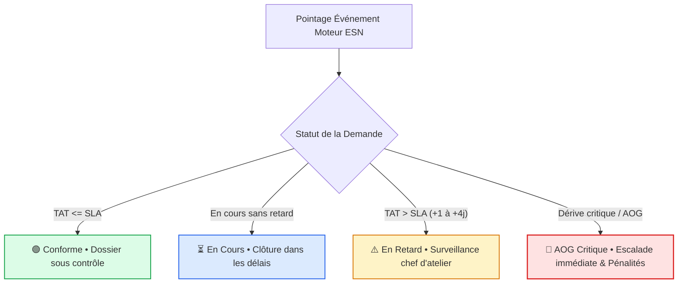

#### 5. Heatmap d'Occupation Réseau par Site (Illustration 4.H)
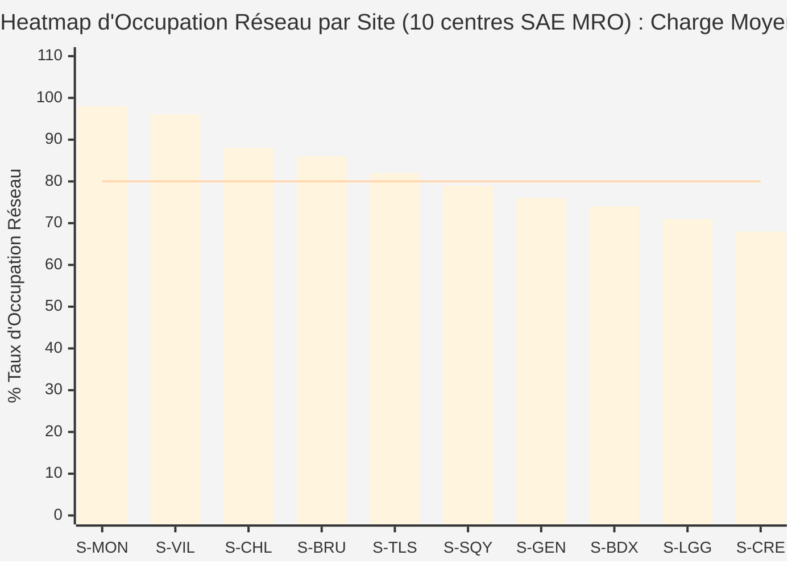

#### 6. Benchmark TAT Demande : 4 Méthodes vs Effectif Référence (Illustration 4.I)
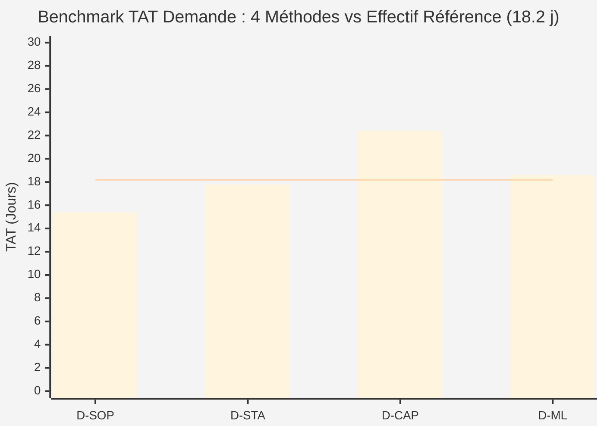

---

## Étape 5 : Capacité

> **Question de cadrage :** Sur quelle base dimensionner et projeter la capacité des interventions d'atelier sur chaque shop (`S-XXX`) ?  
> **En-tête de l'interface :** Étape 5 : Choisir la méthode d'évaluation de la Capacité d'Intervention en Atelier

> **Rendu Tableau & Modes de Vue (Étape 5) :** Le panneau latéral droit dispose d'un sélecteur à 4 modes :
> - **`data` :** Vue tableau interactive propulsée par Grid.js (tri multi-colonnes, pagination 15/15 avec résumé, redimensionnement) et bouton d'édition des mesures `✎` (`#mesure-generator-modal`, interface unifiée avec le générateur de données, support de tous les types de champs, mode distribution ou formule compact avec autocomplétion des opérateurs et champs, tooltip d'aide Excel-like et validation syntaxique instantanée).
> - **`uml` :** Modèle relationnel UML ciblé affichant uniquement les tables et champs intervenant dans l'évaluation de la Capacité, avec commandes de zoom/pan (+, −, ↺) et mode éditeur en cas de mesure personnalisée (`+ Mesure`).
> - **`chartjs` :** Prompt IA standardisé et personnalisable (bouton template `✎` visible sur ce mode, copie `⧉`) formulant des propositions de visualisations comparatives à partir de l'option active et des diagrammes relationnels ERD 2.A et 2.B.
> - **`visuels` :** Prompt IA structuré formulant 3 idées de visuels compatibles SAP-IBP / SAC.

### Les 4 Méthodes d'Évaluation de la Capacité :
1. **Option 5.A : Capacité S&OP (C-SOP)**
   - *Description :* Capacité nominale planifiée pour l'arbitrage réseau et la réservation des créneaux à moyen terme (12–36 mois).
   - *Principe :* Adéquation globale entre les volumes d'heures prévisionnels et l'ouverture théorique des baies (`SUM(MDT_INTERVENTION[HEURES_GAMME])` / `[CAPACITE_HEURES_SHOP]`).
   - *Usage MRO :* Plan industriel de charge, équilibrage multi-sites et dimensionnement des équipes.
   - *Formule DAX :* `Charge_SOP = DIVIDE(SUM(MDT_INTERVENTION[HEURES_GAMME]), [CAPACITE_HEURES_SHOP])`
2. **Option 5.B : Projection statistique (C-STA)**
   - *Description :* Cadence réelle d'écoulement et débit effectif basés sur les moteurs actuellement en cours (WIP) dans les ateliers.
   - *Principe :* Extrapolation du rythme de sortie constaté sur les dernières semaines selon l'en-cours actif.
   - *Usage MRO :* Régulation hebdomadaire des lancements et détection des baisses de rythme aux postes.
   - *Formule DAX :* `Debit_Stats = CALCULATE([INTERVENTIONS_CLOTUREES], DATESINPERIOD('Calendar'[Date], TODAY(), -3, MONTH))`
3. **Option 5.C : Projection logistique (C-LOG)**
   - *Description :* Capacité d'intervention alignée sur la disponibilité effective des pièces et kits critiques de réparation (OTIF).
   - *Principe :* Capacité utile bridée par la pièce manquante la plus lente (aubes, disques, kits LLP).
   - *Usage MRO :* Synchronisation des montages d'intervention sur les dates confirmées d'approvisionnement.
   - *Formule DAX :* `Capacite_Logistique = MIN([CAPACITE_POSTES], [KITS_DISPO] * [CADENCE_STANDARD])`
4. **Option 5.D : Modélisation avancée (C-ML)**
   - *Description :* Capacité prédictive intégrant les retouches d'usinage, les contrôles CND et la disponibilité des bancs d'essai.
   - *Principe :* Simulation prévisionnelle tenant compte des taux de rebut et pannes d'équipements critiques.
   - *Usage MRO :* Dimensionnement dynamique des stocks tampons et gestion proactive de la variabilité.
   - *Formule DAX :* `Capacite_ML = FORECAST_CAPACITY([INTERVENTIONS_PREVUES], [ALEAS_CND], [DISPO_BANCS])`

### Extraits des Vues Capacitaires d'Atelier (Croisement Granularité × Capacité)

#### Extrait A : Lignes d'Intervention (MDT_INTERVENTION) × Capacité S&OP par Shop (5.A C-SOP)
```text
| SHOP_ASSIGNE | TYPE_REPARATION | INTERVENTIONS_PLANIFIEES | CAPACITE_ALLOUEE | TENSION_PREVISIONNELLE  |
| :----------- | :-------------- | :----------------------- | :--------------- | :---------------------- |
| S-MON        | T-AUBTUR        | 68 interventions         | 72 slots max     | 94.4 % (Tendu)          |
| S-VIL        | T-MAJLOU        | 42 interventions         | 48 slots max     | 87.5 % (OK)             |
| S-BRU        | T-BANESS        | 35 passages banc         | 30 slots max     | 116.7 % (Saturation 🚨) |
```
*Formule DAX associée :* `Tension_Intervention_SOP = DIVIDE(SUM(MDT_INTERVENTION[INTERVENTIONS_PLANIFIEES]), [CAPACITE_SHOP_PERIODE])`

#### Extrait B : Lignes d'Intervention (MDT_INTERVENTION) × Projection Statistique / WIP en Shop (5.B C-STA)
```text
| SHOP_ASSIGNE | TYPE_REPARATION | INTERVENTIONS_WIP | POSTES_STATION_TAMPON | TAUX_OCCUPATION |
| :----------- | :-------------- | :---------------- | :-------------------- | :-------------- |
| S-MON        | T-AUBTUR        | 22 en cours       | USI-04, CND-02        | 91.7 % ⚠️       |
| S-VIL        | T-EQUROT        | 11 en cours       | EQU-01, USI-01        | 68.8 %          |
| S-BRU        | T-BANESS        | 10 en cours       | TST-01                | 100.0 % 🚨      |
| S-SQY        | T-COMHOT        | 8 en cours        | CHAU-01               | 78.4 %          |
```
*Formule DAX associée :* `Occupation_Shop_Live = DIVIDE(COUNTROWS(FILTER(MDT_INTERVENTION, ISBLANK([HORODATAGE_FIN]))), [CAPACITE_INTERVENTIONS_HEBDO])`

---

## Étape 6 : Saturation

> **Question de cadrage :** Quels visuels choisir pour repérer les goulots d'intervention et la surcharge des ateliers (`S-XXX`) ?  
> **En-tête de l'interface :** Étape 6 : Sélectionner les visuels pour la Saturation des Interventions en Atelier  
> **Rendu Chart.js & Modes de Vue (Étape 6) :** Les cartes d'options disposent d'un panneau à droite piloté par un sélecteur à 5 modes :
> - **`ui` :** Vue graphique Chart.js interactive (dont Treemap 6.H avec drill-down au clic Moteurs ➔ Réparations et Heatmap 6.F par semaine).
> - **`config` :** Configuration JSON Chart.js éditable en temps réel avec répercussion instantanée sur le rendu graphique `ui` et persistance automatique.
> - **`chartjs` :** Prompt IA permettant de générer une configuration Chart.js à partir des entrées calculées et des schémas ERD.
> - **`visuels` :** Prompt IA structuré de génération de 3 idées de visuels SAP-IBP / SAC.
> - **`sap` :** Descriptif technique structuré et autoporteur en Markdown aligné sur l'interface et les possibilités natives de SAP-IBP et SAC (titre, composant SAC, modèle MDT IBP, dimensions, mesures et Key Figures, filtres, règles et seuils d'alerte) avec bouton copier.

### Les 9 Graphiques de Saturation :
- **6.A : Taux de Retard par Shop**  
  *Description métier :* Pourcentage d'interventions en retard par atelier MRO face au seuil contractuel de tolérance de 10%.  
  *Personas cibles :* SHPL & NTPL.  
  *Analytics SAC / IBP :* Column / Bar Chart avec Seuil de Tolérance (10%) | Axes : X = `SHOP_ASSIGNE` (`S-XXX`) • Y = `% INTERVENTION_DELAY_RATE` | Dimensions : `SHOP_ASSIGNE` (S-MON, S-VIL, S-CHL, S-BRU, S-TLS, S-SQY, S-GEN, S-BDX, S-LGG, S-CRE) | Mesures : `INTERVENTION_DELAY_RATE` (%), `SEUIL_RETARD_TOLERANCE` (10%), `TOTAL_INTERVENTIONS_COUNT`.  
  *Rendu :* Barres de taux de retard par atelier face à la ligne de seuil de tolérance (10%), avec coloration d'alerte (rouge si ≥ 15%, ambre si ≥ 10%).  
  *Badges personas & usages :* `SHPL`, `NTPL`, `DGOV`.
- **6.B : Retards par Type & Shop**  
  *Description métier :* Part des interventions subissant un aléa ou décalage imprévu selon la spécialité technique et l'atelier.  
  *Personas cibles :* FTM & DMMG.  
  *Analytics SAC / IBP :* Clustered Column Chart (Comparatif Types d'Intervention) | Axes : X = `TYPE_REPARATION` (`T-XXXXXX`) • Y = `% UNPLANNED_DELAY_RATE` | Dimensions : `TYPE_REPARATION` (T-INSCND, T-AUBTUR, T-BANESS, T-EQUROT), `SHOP_ASSIGNE` (S-MON, S-VIL, S-BRU) | Mesures : `DELAYED_INTERVENTIONS_PCT`, `AVG_SLIPPAGE_HOURS`.  
  *Rendu :* Barres groupées par type d'intervention et atelier avec pourcentages affichés par défaut.  
  *Badges personas & usages :* `FTM`, `DMMG`, `SHPL`, `DGOV`.
- **6.C : Routes de Transfert Inter-Shops**  
  *Description métier :* Principales navettes logistiques entre ateliers : volume de pièces transférées et délai moyen d'acheminement.  
  *Personas cibles :* NTPL & SHPL.  
  *Analytics SAC / IBP :* Dual-Axis Combination Bar & Line Chart (Flux & Délais) | Axes : X = `ROUTE_TRANSFERT` (Origine ➔ Destination) • Y1 = Part Volume (%) • Y2 = `TRANSIT_DAYS` | Dimensions : `SHOP_SOURCE` ➔ `SHOP_DEST` (S-MON ➔ S-VIL, S-CHL ➔ S-BRU, S-VIL ➔ S-SQY) | Mesures : `INTER_SHOP_TRANSFER_VOLUME_PCT`, `AVG_TRANSIT_DURATION_DAYS`.  
  *Rendu :* Barres de volume de flux d'interventions combinées à la courbe des délais de navette avec valeurs visibles sur chaque point et barre.  
  *Badges personas & usages :* `NTPL`, `SHPL`, `DMMG`.
- **6.D : Décomposition du Délai par Shop**  
  *Description métier :* Décomposition du temps de cycle moyen en heures par atelier : attente file/pièces, usinage effectif et transit.  
  *Personas cibles :* SHPL & Continuous Improvement.  
  *Analytics SAC / IBP :* Horizontal Stacked Bar Chart (Délai Moyen Décomposé) | Axes : X = Heures Moyennes de Traitement (h) • Y = `SHOP_ASSIGNE` (`S-XXX`) | Dimensions : `SHOP_ASSIGNE` (10 shops SAE), `STATUT_TEMPS` (Attente File/Pièces, Réparation Effective, Transfert Logistique) | Mesures : `AVG_QUEUE_HOURS`, `AVG_REPAIR_HOURS`, `AVG_TRANSIT_HOURS`, `TOTAL_INTERVENTION_HOURS`.  
  *Rendu :* Barres horizontales empilées décomposant pour chaque shop le délai moyen en attente file/pièces (ambre), usinage/réparation effectif (bleu) et transit logistique (violet).  
  *Badges personas & usages :* `SHPL`, `DMMG`, `DGOV`.
- **6.E : Taux de Charge par Station**  
  *Description métier :* Taux d'occupation de chaque banc et machine de réparation face au seuil d'engorgement critique de 85%.  
  *Personas cibles :* SHPL & NTPL.  
  *Analytics SAC / IBP :* Horizontal Bar Chart avec Threshold Line (Seuil de Saturation 85%) | Axes : X = `TAUX_OCCUPATION_STATION` (%) • Y = `ID_STATION` (`S-XXX-YY`) | Dimensions : `ID_STATION` (S-MON-01 à S-CRE-03, 3 à 10 stations par shop), `SHOP_ASSIGNE` (`S-XXX`) | Mesures : `TAUX_OCCUPATION_STATION` (%), `SEUIL_SATURATION_CRITIQUE` (85%).  
  *Rendu :* Barres horizontales de charge par station face à la ligne rouge critique des 85%, isolant les machines et baies goulots.  
  *Badges personas & usages :* `SHPL`, `NTPL`.
- **6.F : Heatmap d'Occupation des Stations**  
  *Description métier :* Intensité hebdomadaire de charge de chaque poste de travail sur les semaines S34 à S42 pour cibler les goulots.  
  *Personas cibles :* SHPL & Continuous Improvement.  
  *Analytics SAC / IBP :* Heatmap Matrix SAC (Saturation Stations Shop) | Axes : X = Semaines Calendaires (S34 à S42) • Y = Stations de Réparation du Shop (`S-MON-YY`) | Dimensions : `SHOP_ASSIGNE` (S-MON), `ID_STATION` (S-MON-01 à S-MON-06), `SEMAINE_CALENDAIRE` (S34..S42) | Mesures : `WORKLOAD_TENSION_RATE` (%), `SEUIL_SATURATION_CRITIQUE` (85%).  
  *Rendu :* Matrice thermique croisant les stations du shop (en Y) et les semaines calendaires S34 à S42 (en X) avec code couleur de saturation (rouge ≥ 90%, ambre ≥ 85%).  
  *Badges personas & usages :* `SHPL`, `NTPL`, `DMMG`.
- **6.G : Entrées vs Sorties (WIP)**  
  *Description métier :* Flux cumulé mesurant les inductions d'interventions, les clôtures effectives et le volume d'en-cours atelier.  
  *Personas cibles :* DMMG & NTPL.  
  *Analytics SAC / IBP :* Cumulative Flow Diagram (Area / Multi-Line Chart SAC) | Axes : X = `TIMEPROFILE` (Jours Ouvrés J1-J10) • Y = Cumul Lignes d'Intervention | Dimensions : `FLUX_DIRECTION` (Cumul Lignes Interventions Lancées vs Clôturées) | Mesures : `CUMULATIVE_INTERVENTION_INDUCTION`, `CUMULATIVE_INTERVENTION_RELEASE`, `SHOP_WIP_INTERVENTIONS`.  
  *Rendu :* Courbes d'accumulation avec volumes d'interventions visibles par défaut sur chaque jalon journalier.  
  *Badges personas & usages :* `DMMG`, `NTPL`, `FINC`, `DGOV`.
- **6.H : Treemap Temps & Retards**  
  *Description métier :* Volume d'heures d'intervention par type de moteur (avec zoom par opération au clic) et couleur d'alerte retard.  
  *Personas cibles :* SHPL & EOWN.  
  *Analytics SAC / IBP :* Interactive Hierarchical Treemap (Drill-down Moteur ➔ Réparation) | Axes : N/A (Taille du Bloc = Temps Passé en Heures • Couleur = Taux de Retard %) | Dimensions : Niveau 1 = `ENGINE_TYPE` (CFM56-7B, LEAP-1A...) ➔ Niveau 2 = `TYPE_REPARATION` (T-AUBTUR, T-COMHOT...) | Mesures : `TEMPS_PASSE_HEURES`, `TAUX_RETARD_INTERVENTIONS` (%), `SEUILS_RETARD` (8% / 15%).  
  *Rendu :* Treemap interactive à deux niveaux sur le shop : vue initiale par type de moteur, drill-down au clic pour explorer la répartition par type de réparation. Coloration trichromatique selon le taux de retard (vert < 8%, ambre 8-15%, rouge > 15%).  
  *Badges personas & usages :* `SHPL`, `EOWN`, `NTPL`.
- **6.I : Comparatif 4 Méthodes vs Réel**  
  *Description métier :* Comparaison de la capacité d'interventions simulée selon les 4 approches face au débit réel de 124 dossiers/mois.  
  *Personas cibles :* DGOV & NTPL.  
  *Analytics SAC / IBP :* Clustered Bar & Deviation Line Chart (Benchmark Capacité) | Axes : X = `METHODE_PREVISION` (C-SOP, C-STA, C-LOG, C-ML) • Y1 = `CAPACITE_SIMULEE_INTERVENTIONS` • Y2 = `%_DEVIATION_VS_EFFECTIF` | Dimensions : `METHODE_CHARGE_CAPA` (C-SOP, C-STA, C-LOG, C-ML), `INTERVALLE_CERTITUDE` | Mesures : `CAPACITE_PREVUE_INTERVENTIONS`, `CAPACITE_EFFECTIVE_REF` (124 interventions), `ECART_CHARGE_PCT`, `TAUX_COMPLETUDE_MES` (96.1%).  
  *Rendu :* Histogramme à barres comparant la charge/capacité simulée de chaque méthode face au débit effectif mesuré, avec courbe du pourcentage d'écart et taux de complétude des données.  
  *Badges personas & usages :* `DGOV`, `NTPL`, `SHPL`.

### Illustrations Graphiques en Mermaid (Étape 6)

#### 1. Taux de Retard des Interventions par Shop (Illustration 6.A)
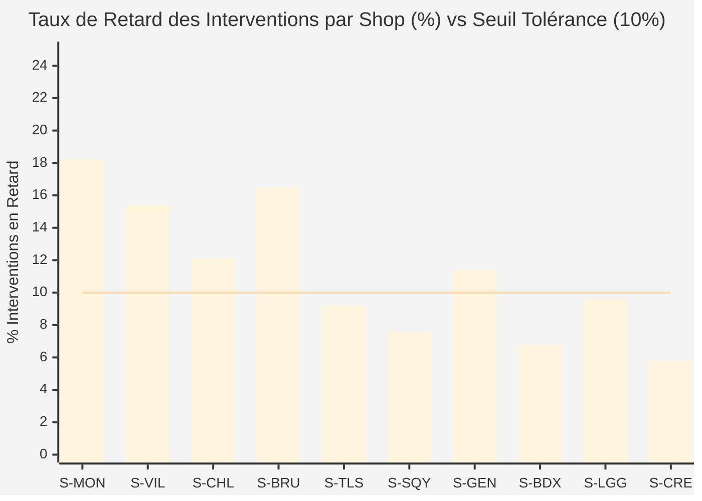

#### 2. Dérive et Retard par Type d'Intervention en Shop (Illustration 6.B)
```mermaid
%%{init: {'theme': 'base'}}%%
xychart-beta
    title "Part des Interventions Subissant un Aléa Imprévu (% Retard) : CFM56 vs LEAP"
    x-axis ["T-REVCAR", "T-INSCND", "T-AUBTUR", "T-BANESS"]
    y-axis "% Interventions Décalées" 0 --> 35
    bar [18, 14, 12, 8]
    bar [29, 24, 26, 17]
```

#### 3. Top des Routes de Transfert Inter-Shops (Illustration 6.C)
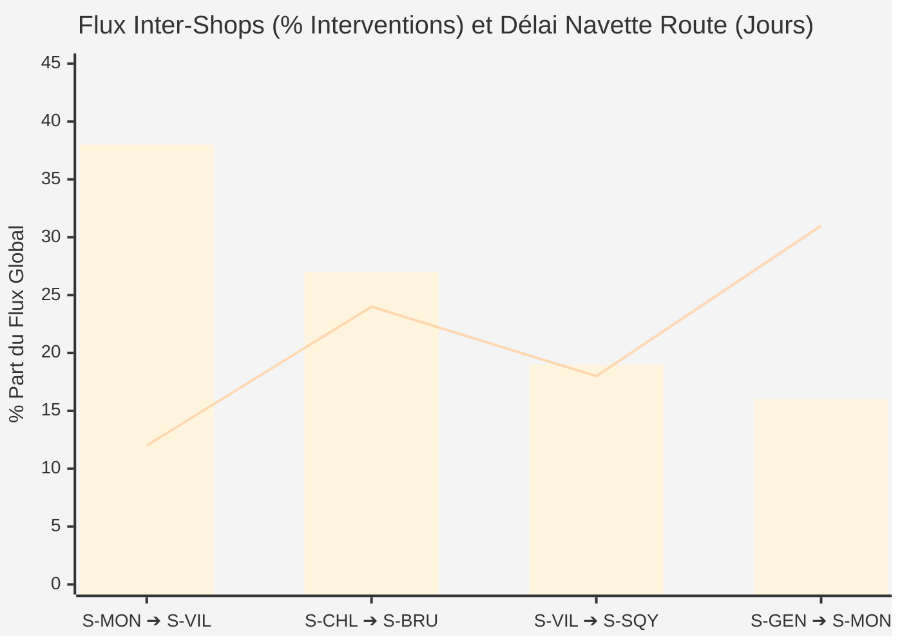

#### 4. Décomposition du Délai Moyen d'Intervention par Shop (Illustration 6.D)
```mermaid
%%{init: {'theme': 'base'}}%%
xychart-beta
    title "Délai Moyen d'Intervention par Shop (h) : Attente vs Réparation vs Transfert"
    x-axis ["S-MON", "S-VIL", "S-CHL", "S-BRU", "S-TLS", "S-SQY", "S-GEN", "S-BDX"]
    y-axis "Heures Moyennes Cumulées" 0 --> 35
    bar [7.5, 6.8, 5.2, 6.1, 4.3, 3.4, 4.1, 2.9]
    bar [18.2, 21.5, 16.4, 17.0, 15.2, 12.8, 14.0, 11.5]
    bar [3.8, 3.2, 2.8, 3.5, 2.6, 2.1, 2.3, 1.9]
```

#### 5. Taux de Charge par Station de Réparation (Illustration 6.E)
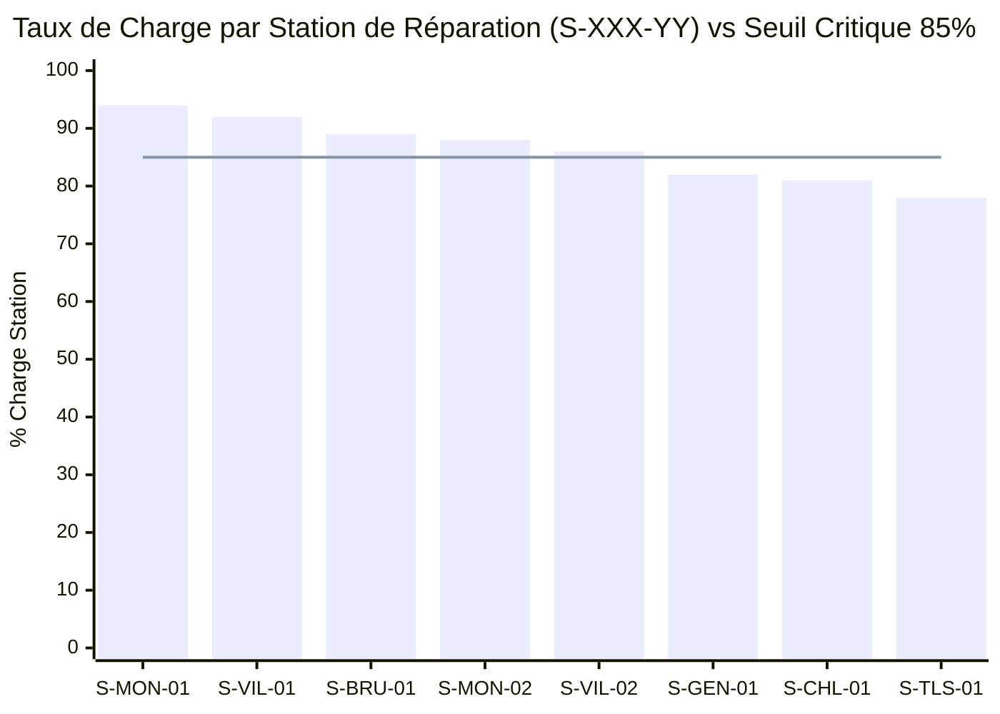

#### 6. Heatmap d'Occupation des Stations du Shop S-MON (Illustration 6.F)
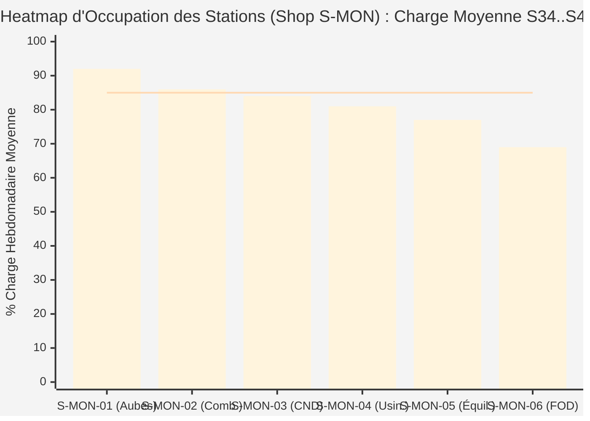

#### 7. Treemap Temps Passé & Taux de Retard Trichromatique Shop S-MON (Illustration 6.H)
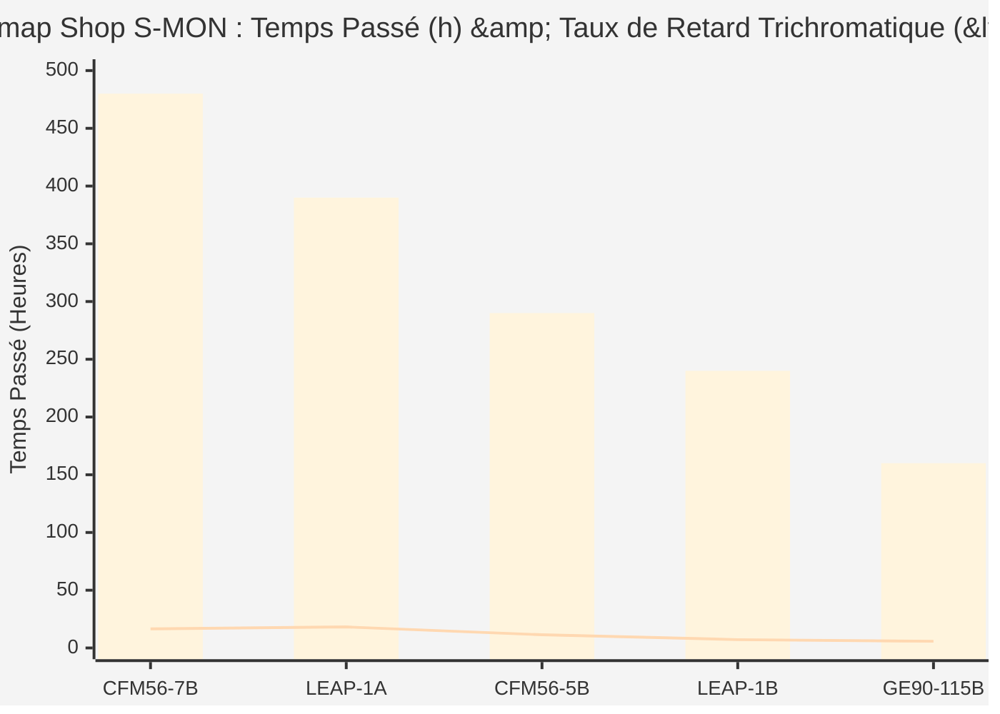

#### 8. Benchmark Capacité Interventions Shop : 4 Méthodes vs Débit Réel (Illustration 6.I)
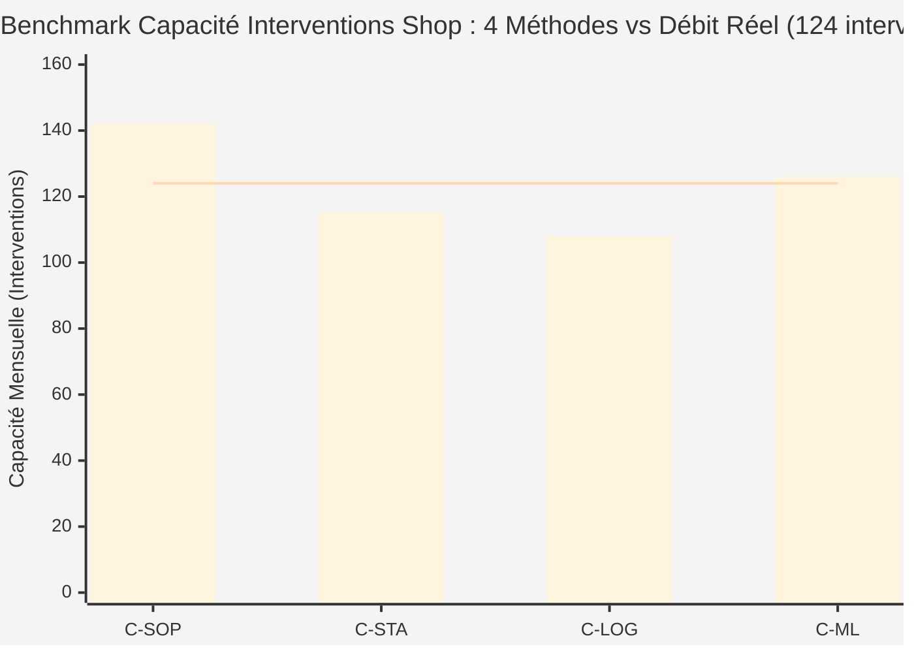

---

## Étape 7 : Synthèse, Profils & Dashboard Dérivé

> **Question de cadrage :** Comment structurer la restitution finale pour engager les parties prenantes ?  
> **En-tête de l'interface :** Étape 7 : Slide de Synthèse Décisionnel & Dashboard Projeté (`✨ Fiche Architecture`)

### Profils Décisionnels Personas SAE & Recommandations Dérivées :
Selon l'option sélectionnée en Étape 1, le dashboard projette un profil persona dédié :
- **EOWN · Processus RTI & Jalons Moteurs/Modules :** Modèle opérationnel sur `MDT_MAINTENANCE_REQUEST` traçant les jalons du processus **RTI (Return to Operation)** en temps réel dans SAP IBP, détection des dérives sur modules MM/SM, priorisation d'atelier et maîtrise des coûts (IBP to Cost Tracker).
- **CSPM · Engagements Contractuels & Removal Plan (PERF) :** Modèle tabulaire reliant le removal plan client (PERF) aux faits d'induction SAP IBP, suivi des dates de Shop Visit et simulation de scénarios pour garantir le Customer Service Level.
- **NTPL · Équilibrage Réseau 12-36 mois & Slots :** Modèle consolidant la charge/capacité multi-ateliers across all shops, adhérence **MPS vs S&OP** et arbitrage des slots réacteurs / modules (MM, SM) pour éliminer les lost slots.
- **FINC · Volumes IBP, Mix & Coûts SV :** Rapprochement des volumes consolidés et du mix moteurs/modules avec les coûts réels de Shop Visit (IBP to Cost Tracker), pénalités contractuelles de retard chiffrées en jours ouvrés.
- **SHPL · Ordonnancement Atelier & Aléas Court Terme :** Modèle d'atelier réactif absorbant les aléas quotidiens (pannes machines, retards amont, absences), séquencement des flux moteurs et modules (MM, SM, isolés ou sous-traités) pour maximiser la MPS Adherence.
- **DMMG & FTM · Prévisions Demande & Workscopes (Walk) :** Consolidation multi-sources de la demande Shop Visit (Monthly Demand Review), intégration des workscopes techniques dans Walk, analyse de variance début/fin de SV et alimentation S&OP/MTP.
- **DGOV · Qualité des Données & Fiabilité des Modèles :** Modèle d'audit et gouvernance sur `MDT_MAINTENANCE_REQUEST` assurant la complétude des saisies d'atelier (MES), le benchmark statistique des méthodes de calcul de TAT et de capacité face aux données effectives constatées sur le terrain, avec certification du degré de certitude et auditabilité Part-145.

### Fonctionnalités Clés du Slide Décisionnel :
1. **Dropdowns Interactifs Synchronisés (`#select-q1` à `#select-q6`) :**
   Permettent de modifier instantanément un choix sans devoir reboucler les étapes antérieures.
2. **Barre de Filtres Multidimensionnelle Dynamique :**
   - *Filtre Site (10 sites) :* Tous, FR-Villaroche (VIL), FR-Montereau (MON), FR-Châtellerault (CHL), BE-Bruxelles (BRU), FR-Saint-Quentin (SQY), FR-Gennevilliers (GEN), FR-Bordeaux (BDX), FR-Toulouse (TLS), BE-Liège (LGG), FR-Le Creusot (CRE).
   - *Filtre Client (Vraies compagnies) :* Toutes compagnies, Air France (AFR), Air China (CCA), EasyJet (EZY), Lufthansa (DLH), Delta Air Lines (DAL), Emirates (UAE), Singapore Airlines (SIA).
   - *Filtre Moteur (6 flottes) :* CFM56-7B, CFM56-5B, LEAP-1A, LEAP-1B, GE90-115B, M88-2.
   - *Filtre Date Calendaire Jour :* Sélecteur de date d'entrée prédictive couplé au calcul automatique de la **Date Prévisionnelle de restitution** (`Date + TAT Médian`).
3. **Quatuor de Cartes KPIs Dynamiques :**
   - KPI 1 : Dérive métier selon l'objectif Q1 (ex: AOG critiques, pénalités financières encourues, % SLA).
   - KPI 2 : Suivi opérationnel (dossiers en sursis, livraisons conformes, kits en rupture).
   - KPI 3 : TAT moyen glissant et bornes de dispersion $P_5 - P_{95}$ (selon Q3).
   - KPI 4 : Taux de charge et certitude d'adéquation capacitaire (selon Q5).
4. **Visualisations Temps Réel Croisées :**
   - Cadre gauche : Visualisation du délai calibrée selon l'option choisie en Étape 4 (de 4.A à 4.H) avec axes explicites et valeurs par défaut.
   - Cadre droit : Visualisation de la saturation calibrée selon l'option choisie en Étape 6 (de 6.A à 6.H) avec axes explicites et valeurs par défaut.
5. **Recommandations d'Architecture BI & Mesures DAX Déduites :**
   - Formulations automatiques suggérant les colonnes calculées, les liens d'étoile avec le calendrier industriel ouvré et les règles de partitionnement DirectQuery / Import selon la combinaison `[Q1, Q2, Q3, Q4, Q5, Q6]`.

---

## Stratégie de Génération de Données & Moteur Pseudo-Aléatoire Seedé

Cette section formalise la stratégie d'ingénierie des données et de mock dynamique déployée dans Maestro, garantissant à la fois **l'indépendance de la structure**, **la reproductibilité des tests** et **la cohérence physique des indicateurs**.

### 1. Découplage Structure vs Métriques Chiffrées
Afin d'assurer une étanchéité totale entre la nomenclature métier et les calculs dynamiques :
- **`data.json` ne contient AUCUN chiffre figé :** il agit comme un catalogue de référence déclarant uniquement les dimensions, entités réelles (10 sites SAE MRO, 7 compagnies aériennes réelles, 6 familles moteurs, références de pièces au format `Pxxxxx`, demandes au format `D-xxxxx`) et liens structurels.
- **Les visualisations Chart.js sont alimentées à chaud :** les séries temporelles, percentiles, pourcentages de saturation et matrices de charge sont instanciés dynamiquement en mémoire via la fonction `buildMaestroData(base)`.

```text
┌─────────────────────────┐       ┌──────────────────────────────┐
│       data.json         │       │    Mulberry32 (PRNG Seed)    │
│  (Structure & Entités)  │       │   (Reproductibilité session) │
└────────────┬────────────┘       └──────────────┬───────────────┘
             │                                   │
             └───────────────┬───────────────────┘
                             ▼
                 ┌───────────────────────┐
                 │  buildMaestroData()   │
                 │ (Règles de Cohérence) │
                 └───────────┬───────────┘
                             ▼
                 ┌───────────────────────┐
                 │ Tableaux & Graphiques │
                 │ (Chart.js 4.4 + DAX)  │
                 └───────────────────────┘
```

### 2. Reproductibilité & Stabilité par PRNG Seedé (`Mulberry32`)
Pour éviter le clignotement des valeurs d'une interaction à l'autre tout en permettant des variations contrôlées :
- L'algorithme pseudo-aléatoire **Mulberry32** (générateur 32 bits rapide et uniforme) est initialisé avec une graine (`seed`) fixe (valeur par défaut : `42`).
- Cette graine est persistée dans le `localStorage` du navigateur (`maestro_seed`).
- **Bénéfice didactique :** un utilisateur ou formateur retrouve exactement le même jeu d'essai lors d'une démonstration, tout en pouvant régénérer un jeu alternatif cohérent via `resetFilters()`.

### 3. Règles de Cohérence Physique Industrielle MRO
Le moteur de mock applique un ensemble d'invariants mathématiques et opérationnels pour garantir la crédibilité décisionnelle :

1. **Hiérarchie Stricte des Percentiles ($P_5 < P_{50} < P_{95}$) :**
   - La médiane $P_{50}$ est calibrée sur le standard constructeur de la famille moteur (ex: ~14.9j pour CFM56-7B, ~21.6j pour LEAP-1A, ~26.2j pour GE90-115B).
   - La borne basse $P_5$ est contrainte entre 60% et 70% de la médiane ($P_{50}$).
   - La borne haute $P_{95}$ est contrainte entre 140% et 165% de la médiane ($P_{50}$).
2. **Décomposition Additive du TAT (100% du délai total) :**
   - Pour chaque site, le TAT global décomposé respecte : $\text{TAT} = \text{Réparation (9 à 12.5j)} + \text{Attente (2.5 à 7j)} + \text{Transfert Navette (1.5 à 4j)}$.
3. **Statut d'Urgence et Modélisation des Pénalités Financières :**
   - Un dossier `Conforme` a un retard contractuel nul ($\Delta_{\text{SLA}} = 0$).
   - Un dossier `En Retard` subit un retard de 2 à 5 jours.
   - Un dossier `AOG Critique` subit un retard sévère de 8 à 18 jours.
   - Les pénalités financières encourues sont mathématiquement calculées par la formule :
     $$\text{Pénalités (€)} = \text{Retard (jours)} \times \text{Barème journalier contractuel (1 500 € à 2 500 € / j)}$$
4. **Détection des Goulots d'Atelier & Seuil Critique de 85% :**
   - Les heures de rupture de stock sont directement proportionnelles au statut de criticité du composant (Critique : 55 à 90h, Modéré : 30 à 55h, Veille : 10 à 30h).
   - Les îlots et machines dont la charge dépasse 85% déclenchent automatiquement un code couleur ambre/rouge sur les jauges et la heatmap 2D (Étape 6.F).

### 4. Guide de Transposition à un Autre Domaine Métier
Pour injecter des données d'un autre secteur industriel (ex: ferroviaire ou naval) :
1. Remplacer les entités de `data.json` par vos matériels, centres techniques et clients.
2. Ajuster l'objet `p50Base` dans `index.html` avec les durées nominales de vos interventions.
3. Conserver le moteur `buildMaestroData()` : il propagera automatiquement des données chiffrées cohérentes, plausibles et visuellement démonstratives dans l'ensemble des 8 visualisations de délai et 8 visualisations de charge.

---

## Panneaux Visuels & Données (Étapes 3 à 6)

Afin d'offrir une flexibilité maximale aux utilisateurs, experts métiers, architectes BI et développeurs, les panneaux latéraux des **Étapes 3 à 6** disposent de sélecteurs multi-vues complémentaires :

1. **Panneaux Tabulaires de Calcul (Étapes 3 et 5) :**
   - Bouton `ui` : affiche le tableau dynamique de calcul (données factuelles et indicateurs calculés).
   - Bouton `chartjs` : affiche le prompt IA Markdown pour proposer un code Chart.js à partir des entrées calculées et des schémas 2.A/2.B (`copyTableAi(step)`).
   - Bouton `visuels` : affiche le prompt IA structuré proposant 3 idées de visuels compatibles SAP-IBP / SAC (`copyVisuelsPrompt(step)`).
   - Bouton `✎` : ouvre la modale de personnalisation du template de prompt (`openPromptTemplateModal(step)`).

2. **Panneaux Graphiques (Étapes 4 et 6) :**
   - Bouton `ui` : affiche le rendu canvas Chart.js interactif (rendu responsive haute performance).
   - Bouton `config` : présente la configuration JSON éditable de l'objet Chart.js avec synchronisation en direct sur la vue `ui` et persistance (`copyChartConfigJson(step)`).
   - Bouton `chartjs` : affiche le prompt IA permettant de générer une configuration Chart.js à partir des entrées calculées et des schémas 2.A/2.B (`copyChartJsPrompt(step)`).
   - Bouton `visuels` : expose le prompt IA structuré de génération de 3 idées de visuels SAP-IBP / SAC basé sur les étapes 1, 2, 3/5 et 4/6 (`copyVisuelsPrompt(step)`).
   - Bouton `sap` : affiche le prompt IA de transposition pas à pas vers SAP-IBP / SAC (`copyChartSapPrompt(step)`).
   - Bouton `↻` : réinitialise le graphique à sa configuration standard d'origine.
   - Bouton `✎` : permet d'éditer le template de prompt associé dans la modale.


